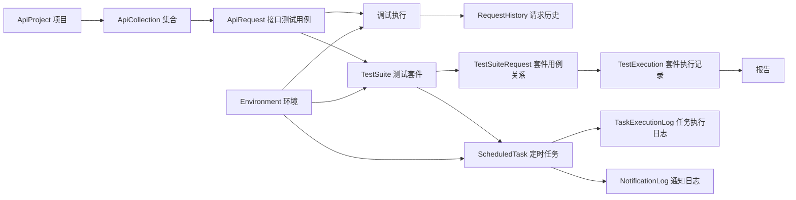

# 接口自动化对象级闭环审计

更新时间：2026-06-18

状态：审计汇总，作为后续修复阶段拆分依据

## 1. 审计目标

本审计不只判断“页面是否存在”，而是按对象操作粒度检查接口自动化模块是否形成真实用户闭环。

审计口径：

- 是否有业务对象承接点。
- 是否有页面入口。
- 是否有明确按钮、菜单、下拉、拖拽或弹窗承接操作。
- 前端操作是否调用真实后端接口。
- 后端是否真实落库或产生可追踪结果。
- 操作结果是否能在页面重新查回、展示、继续流转。
- 异常、阻断、空态、权限不足、依赖缺失是否有明确反馈。

核心判断：

```text
数据模型支持 != 用户闭环成立
后端接口支持 != 页面操作闭环成立
页面按钮存在 != 功能闭环成立
```

补充确认：

```text
接口测试用例是原子资产，测试套件是编排资产。
AI 生成接口测试用例时只应生成 ApiRequest 兼容字段，不应直接生成测试套件。
```

## 2. 当前核心对象链路



## 3. 对象级闭环现状

| 对象 | 操作 | 当前承接点 | 闭环状态 | 主要断点 |
| --- | --- | --- | --- | --- |
| `ApiProject` | 新建 / 编辑 / 删除 | 项目管理页 | 基本闭环 | 删除前不展示级联影响；负责人字段页面可见但后端只读，容易误导 |
| `ApiProject` | 查看项目下资产 | 项目管理查看弹窗 | 半闭环 | 缺项目详情 / 项目工作台，不能直接进入集合、用例、套件、环境 |
| `ApiCollection` | 新建根集合 | 调试工作区左侧树 | 闭环 | 无 |
| `ApiCollection` | 新建子集合 | 集合右键菜单 | 闭环 | 无 |
| `ApiCollection` | 修改父级 | 集合编辑弹窗代码 | 半闭环 | 完整编辑入口不清晰，右键编辑更像重命名 |
| `ApiCollection` | 排序 | 无 | 不闭环 | 模型有 `order`，页面无上移、下移、拖拽排序 |
| `ApiCollection` | 删除 | 集合右键菜单 | 半闭环 | 删除级联影响没有预览 |
| `ApiRequest` | 新建到集合 | 用例列表 / 调试树 | 闭环 | 无 |
| `ApiRequest` | 新建未分组 | 调试工作区顶部新增 | 半闭环 | 与“新建必须选择集合”的 P0 口径冲突 |
| `ApiRequest` | 编辑请求、断言、脚本 | 调试工作区 | 闭环 | 无 |
| `ApiRequest` | 移动到集合 | 无 | 不闭环 | 后端支持更新 `collection`，页面没有移动按钮、集合下拉或拖拽 |
| `ApiRequest` | 拖拽到集合 | 无 | 不闭环 | 树未启用拖拽，也没有移动后回滚策略 |
| `ApiRequest` | 排序 | 无 | 不闭环 | 模型有 `order`，页面无排序动作 |
| `ApiRequest` | 复制 / 克隆 | 无 | 不闭环 | 可用创建接口承接，但页面没有入口 |
| `ApiRequest` | 单次执行 | 列表 / 调试工作区 | 闭环 | 最近执行状态未回流到用例列表 |
| `ApiRequest` | 加入套件 | 接口测试用例列表 | 闭环 | 无 |
| `Environment` | 新建 / 编辑 / 删除 | 环境管理页 | 闭环 | 删除前不提示被哪些套件或任务引用 |
| `Environment` | 激活 | 环境管理页 | 闭环 | 无 |
| `Environment` | 执行快照 | 请求历史 / 执行记录 | 半闭环 | 历史可见请求数据，但不展示完整环境变量快照 |
| `TestSuite` | 新建 / 编辑 / 删除 | 测试套件页 | 闭环 | 无 |
| `TestSuite` | 复制 | 测试套件页 | 半闭环 | 只复制基础信息，不复制套件内请求 |
| `TestSuiteRequest` | 添加 / 移除用例 | 测试套件页 | 闭环 | 请求树加载口径需要继续收紧到项目内 |
| `TestSuiteRequest` | 启用 / 禁用 | 测试套件页 | 闭环 | 无 |
| `TestSuiteRequest` | 调整执行顺序 | 无 | 不闭环 | 模型有 `order`，页面无拖拽、上移、下移 |
| `TestSuiteRequest` | 编辑套件级断言 | 测试套件页 | 不闭环 | 按钮只提示“功能开发中” |
| `TestExecution` | 查看执行结果 | 测试套件页 | 基本闭环 | 失败项不能跳回请求历史或接口测试用例 |
| `TestExecution` | 生成报告 | 报告页 | 半闭环 | 报告入口不在正式侧栏，后续应迁执行中心 |
| `RequestHistory` | 查看详情 / 重试 / 删除 / 批量删除 | 请求历史页 | 闭环 | 无 |
| `RequestHistory` | 清空历史 | 请求历史页 | 不闭环 | 按钮存在，但当前只提示未实现 |
| `ScheduledTask` | 新建 / 编辑 / 删除 / 启停 / 立即执行 | 定时任务页 | 基本闭环 | 入口归属应迁执行中心；部分请求绕过 API 封装 |
| `TaskExecutionLog` | 查看任务执行日志 | 定时任务页 | 基本闭环 | 日志详情粒度较弱 |
| `NotificationLog` | 查看通知结果 | 通知日志页 | 半闭环 | 配置、触发、日志入口分散 |
| `AIServiceConfig` | CRUD / 测试连接 | API AI 服务配置页 | 半闭环 | 路由仍在 `/api-testing`，归属应进配置中心 |

### 3.1 接口测试用例与测试套件对象边界

当前后续开发必须保持以下边界：

| 对象 | 技术承接 | 产品含义 | 典型操作 |
| --- | --- | --- | --- |
| 接口测试用例 | `ApiRequest` | 单个接口请求资产，包含 method、URL、headers、params、body、auth、assertions 和脚本 | 新建、编辑、执行、移动集合、查看历史、加入套件 |
| 测试套件 | `TestSuite + TestSuiteRequest` | 多个接口测试用例的编排集合，包含执行顺序、启停、套件运行、报告和调度 | 添加用例、移除用例、排序、套件执行、定时任务 |

因此：

- AI 需求分析生成“接口测试用例”时，应优先固定为 `ApiRequest` 字段契约。
- AI 生成结果不应直接包含 `suite_id`、`suite_name`、`suite_order` 等套件编排字段。
- 生成后的接口测试用例采纳入库应先进入接口测试用例列表，再由用户决定是否加入测试套件。
- 这样可以避免 AI Prompt 同时兼顾用例字段和套件结构，降低 P0-2 改动面，并保护现有 AI 生成链路。

## 4. 重点问题样例

### 4.1 接口测试用例无法移动集合

当前事实：

- 后端 `ApiRequest.collection` 字段允许更新。
- 序列化器允许提交 `collection`。
- 页面创建用例时可以选择集合。
- 但已存在用例没有“移动到集合”按钮、弹窗或树拖拽能力。

结论：

```text
模型支持归属变更，后端支持归属变更，但前端没有承接动作，因此用户闭环不成立。
```

### 4.2 集合父子关系半闭环

当前事实：

- 集合模型有 `parent`。
- 新建集合和新建子集合可用。
- 编辑弹窗存在父级集合字段。
- 但右键“编辑”主要是行内重命名，不是完整编辑集合。

结论：

```text
父子关系能创建，但后续调整父级的入口不清晰，属于半闭环。
```

### 4.3 套件级断言是假入口

当前事实：

- `TestSuiteRequest.assertions` 字段存在。
- 测试套件页有“编辑断言”按钮。
- 点击后只提示功能开发中。

结论：

```text
按钮存在但没有真实编辑动作，属于明确不闭环。
```

## 5. P0-P3 修复范围建议

### 5.1 P0：堵住明显断点和假入口

目标：先拆清“接口测试用例”和“测试套件”的页面职责，再修复“用户已经能看到入口，但点不通、改不了、逻辑冲突”的问题。

阶段 A 的第一优先级不是新增数据表，而是拆页面心智：

```text
/api-testing/test-cases = 表格化接口测试用例资产列表，技术承接是 ApiRequest
/api-testing/test-suites = 测试套件编排和执行页面，技术承接是 TestSuite + TestSuiteRequest
/api-testing/automation = 旧入口兼容，重定向到 /api-testing/test-suites
```

拆分要求：

- 接口测试用例页必须是表格资产列表，字段围绕 `ApiRequest` 展示，例如用例名称、方法、URL、所属集合、断言数、更新时间、操作。
- 测试套件页必须只承接套件编排、套件内用例关系、执行顺序、套件执行和结果，不再伪装成接口测试用例列表。
- 两个页面通过明确动作连接，例如“加入套件”“查看套件”“返回用例列表”，不能靠页面命名混在一起。
- 本阶段不新增 `ApiTestCase` 表，仍使用 `ApiRequest` 承接接口测试用例。

建议范围：

| 修复项 | 范围 | 验收标准 |
| --- | --- | --- |
| 接口测试用例 / 测试套件页面职责拆分 | `/api-testing/test-cases`、`/api-testing/test-suites`、导航文案 | 用例页为表格化 `ApiRequest` 资产列表；套件页为 `TestSuite + TestSuiteRequest` 编排执行入口；旧 `/api-testing/automation` 只做兼容重定向；两个页面互不伪装 |
| 接口测试用例移动到集合 | 接口测试用例列表、调试工作区、后端兼容校验 | 已存在用例可移动到同项目任意集合；移动后列表、调试树、历史入口都展示新归属 |
| 调试工作区所属集合编辑 | 调试工作区请求基础信息区 | 打开用例能看到当前所属集合；修改后保存真实更新 `ApiRequest.collection` |
| 未分组策略收口 | 用例列表、调试工作区 | 若坚持必须选集合，则所有新建入口都必须选择集合；若保留未分组，则提供“移动到未分组”明确动作 |
| 请求历史清空按钮处理 | 请求历史页、后端可选 | 要么实现清空当前筛选历史，要么移除按钮，禁止保留假入口 |
| 套件级断言按钮处理 | 测试套件页、`TestSuiteRequest` | 要么实现编辑断言弹窗并保存，要么隐藏按钮，禁止继续提示“开发中” |
| 项目负责人字段契约修正 | 项目管理页或后端序列化器 | 页面不再误导可改负责人；或后端明确支持负责人变更 |
| 高风险操作反馈 | 删除项目、删除集合、删除环境 | 删除前提示会影响的子对象类型，至少说明级联风险 |

P0 非目标：

- 不做执行中心大迁移。
- 不做复杂拖拽排序。
- 不做 AI 采纳完整链路。
- 不重构整个调试工作区。

### 5.2 P1：补齐对象关系操作闭环

目标：让核心对象的归属、排序、复制、引用关系可持续维护。

建议范围：

| 修复项 | 范围 | 验收标准 |
| --- | --- | --- |
| 集合完整编辑入口 | 调试树右键菜单 | 右键区分“重命名”和“编辑集合”；编辑集合可改描述、父级 |
| 集合父级合法性校验 | 前后端 | 禁止集合移动到自身或自己的子孙集合下 |
| 集合排序 | 调试树、后端 `order` | 支持上移 / 下移或拖拽排序，刷新后顺序保持 |
| 接口测试用例排序 | 调试树、后端 `order` | 同集合内用例可排序，刷新后顺序保持 |
| 套件用例排序 | 测试套件页、`TestSuiteRequest.order` | 套件内执行顺序可调整，执行时按页面顺序运行 |
| 套件复制完整化 | 测试套件页、后端可选 | 复制套件时可选择是否复制套件内用例关系和顺序 |
| 接口测试用例复制 | 列表 / 调试工作区 | 可从已有用例复制新用例，并选择目标集合 |
| 最近执行状态回流 | 后端 `ApiRequest` 列表、用例列表 | 用例列表展示最近一次状态、时间、断言通过情况，禁止前端逐行 N+1 请求 |
| 测试套件页请求封装收口 | `frontend/src/api/api-testing.js` | 测试套件页不再直接调用 `@/utils/api` |

### 5.3 P2：执行结果、报告、调度和通知统一闭环

目标：把执行后链路从“能看结果”升级为“能追踪、能回跳、能诊断”。

建议范围：

| 修复项 | 范围 | 验收标准 |
| --- | --- | --- |
| 执行结果失败项回跳 | 测试套件页、请求历史、用例详情 | 失败行可跳到对应请求历史详情和接口测试用例 |
| 执行批次与请求历史关联增强 | 后端模型或响应结构 | 套件执行结果能稳定关联本次产生的请求历史 |
| 环境变量快照展示 | 请求历史 / 执行记录 | 能查看本次执行使用的环境变量快照，避免环境变更后无法复盘 |
| 报告入口归属收口 | 执行中心或报告中心 | 报告页不再作为接口自动化正式二级入口，入口从执行记录自然进入 |
| 定时任务归属收口 | 执行中心 | API 定时任务与 Web/App 定时任务收敛到统一执行中心口径 |
| 通知日志链路收口 | 执行中心 / 通知日志 | 定时任务执行、通知发送、通知日志之间有清晰跳转 |
| 操作日志回看 | 系统管理或审计入口 | 关键对象操作能按项目、对象、用户追踪 |

### 5.4 P3：增强能力和跨模块承接

目标：进入更强的效率能力和 AI 生成资产承接，不再只修断点。

建议范围：

| 修复项 | 范围 | 验收标准 |
| --- | --- | --- |
| 树形拖拽移动 | 集合树 | 支持拖拽接口到集合、拖拽集合调整父级和顺序，失败可回滚 |
| 批量移动接口用例 | 用例列表 | 支持批量移动到集合、批量加入套件 |
| 批量复制 / 导入 / 导出 | 用例列表、调试工作区 | 支持批量复制、导入 Postman / OpenAPI 后进入集合 |
| AI 生成目标类型 | 需求分析链路 P0-2 | 生成功能 / 接口 / Web / App 用例时固化目标类型和 Prompt |
| AI 采纳到接口测试用例 | 需求分析链路 P0-3 | `api_test_case` 结果可采纳为 `ApiRequest`，并选择集合 |
| 接口资产与数据工厂深度联动 | 数据工厂、调试工作区 | 数据工厂数据可被请求参数、请求体、断言稳定引用并追踪来源 |
| 权限与协作细化 | 项目、集合、用例、套件 | 支持更细的编辑、执行、删除权限边界 |

## 6. 推荐实施顺序

建议先做 P0，不要先做大规模 UI 重构。

推荐顺序：

1. 接口测试用例 / 测试套件页面职责拆分。
2. 接口测试用例移动到集合。
3. 调试工作区所属集合编辑。
4. 未分组策略收口。
5. 请求历史清空按钮处理。
6. 套件级断言按钮处理。
7. 项目负责人字段契约修正。
8. 删除级联风险提示。

原因：

- 这些都是用户已经能看到或自然预期会有的动作。
- 多数不要求改数据模型。
- 修复后能立刻改善“逻辑不通”和“操作不闭环”的体感。

## 7. P0 验收清单

- [ ] `/api-testing/test-cases` 是表格化接口测试用例资产列表。
- [ ] 接口测试用例页展示字段围绕 `ApiRequest`，不是测试套件字段，也不是旧调试树改名。
- [ ] `/api-testing/test-suites` 是测试套件编排和执行页面。
- [ ] `/api-testing/automation` 是旧入口兼容重定向，不作为侧边栏正式入口。
- [ ] 测试套件页展示字段围绕 `TestSuite + TestSuiteRequest`，不承接接口测试用例资产列表职责。
- [ ] 接口测试用例页和测试套件页之间通过明确动作连接，例如加入套件、查看套件、返回用例列表。
- [ ] 已存在接口测试用例可以移动到同项目集合。
- [ ] 移动后接口测试用例列表、调试树、用例详情展示一致。
- [ ] 调试工作区能看到并修改所属集合。
- [ ] 新建接口测试用例的集合策略在所有入口一致。
- [ ] 请求历史不存在假清空入口。
- [ ] 套件级断言不存在“开发中”假入口。
- [ ] 项目负责人字段不存在前后端误导。
- [ ] 删除项目、集合、环境前有清晰风险提示。
- [ ] 新增或修改请求仍统一走 `frontend/src/api/api-testing.js -> frontend/src/utils/api.js`。
- [ ] 不引入整页刷新兜底。

## 8. 涉及文件参考

前端主要文件：

- `frontend/src/views/api-testing/ApiTestCaseList.vue`
- `frontend/src/views/api-testing/InterfaceManagement.vue`
- `frontend/src/views/api-testing/AutomationTesting.vue`
- `frontend/src/views/api-testing/RequestHistory.vue`
- `frontend/src/views/api-testing/ProjectManagement.vue`
- `frontend/src/views/api-testing/EnvironmentManagement.vue`
- `frontend/src/api/api-testing.js`

后端主要文件：

- `apps/api_testing/models.py`
- `apps/api_testing/serializers.py`
- `apps/api_testing/views.py`
- `apps/api_testing/urls.py`

相关规则和记忆：

- `AGENTS.md`
- `.cursor/workflow_rules.md`
- `.cursor/architecture.md`
- `.cursor/storage_rules.md`
- `.cursor/project_rules.md`
- `docs/project-memory/current_phase.md`
- `docs/project-memory/module_memory.md`
- `docs/project-memory/task_handoff.md`
