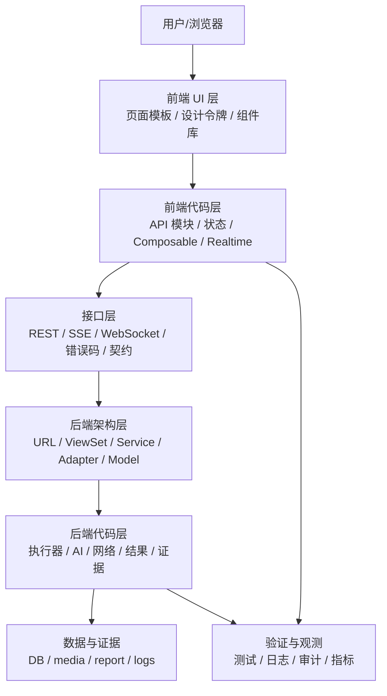

# TestHub 全栈优化开发实现方案

> 版本：v1.0
> 日期：2026-07-01
> 范围：前端样式 UI、前端代码、后端架构、接口治理、后端代码、整体代码注释与文档化。
> 目标：在不强制整体重构、不强制迁移架构的前提下，形成可上线、可维护、可验收、可逐步演进的工程实施方案。

## 1. 背景与原则

### 1.1 当前状态判断

当前项目具备较完整的业务功能，但工程交付标准仍存在明显短板：

- 前端页面大文件较多，UI、状态、请求、弹窗、实时连接、业务规则混杂。
- 前端样式存在大量硬编码颜色、px、`!important`、`deep` 覆盖，新旧视觉风格混用。
- 前端请求未完全收口，仍存在裸 `axios`、直接 `EventSource`、直接 `WebSocket`。
- 后端视图层膨胀，部分核心业务逻辑直接写在 `views.py`，服务层边界不足。
- AI、外部 HTTP、执行结果、证据、验证逻辑分散，缺少统一入口和统一协议。
- 权限、报告访问、公开接口、CSRF 等存在上线前必须修复的问题。
- 测试、日志、注释、接口契约和验收脚本不足。

### 1.2 优化原则

1. **先止血，再治理，再演进**：P0 只处理上线硬风险；P1 强化稳定性；P2 提升可维护性；P3 做体系化演进。
2. **不破坏现有功能路径**：所有接口、路由、菜单、数据字段默认兼容旧行为。
3. **先加适配层，后拆大文件**：不要先大拆页面或视图，先把请求、结果、证据、日志、权限收口。
4. **每个任务必须可验收**：每个子项都给出目标、范围、实施动作、验收标准、建议工时。
5. **禁止无边界重构**：每个迭代只允许修改明确范围内的文件，不做无关格式化和无关命名调整。
6. **统一标准优先于局部美化**：前端 UI 优先建立设计令牌和页面模板，后端优先建立服务边界和接口契约。

### 1.3 优先级定义

- **P0**：上线阻断项。不修复不建议正式交付。
- **P1**：上线稳定项。影响可维护性、故障恢复、用户体验和回归效率。
- **P2**：工程质量项。减少技术债，提高复用、扩展和团队协作效率。
- **P3**：长期演进项。架构分层、平台化治理、自动化质量门禁和标准化资产沉淀。

### 1.4 重点证据文件

- 后端大文件：
  - `apps/requirement_analysis/views.py`
  - `apps/ui_automation/views.py`
  - `apps/api_testing/views.py`
  - `apps/ui_automation/test_executor.py`
  - `apps/app_automation/runners/ui_flow_runner.py`
- 前端大文件：
  - `frontend/src/views/api-testing/InterfaceManagement.vue`
  - `frontend/src/views/app-automation/test-cases/SceneBuilder.vue`
  - `frontend/src/views/data-factory/DataFactory.vue`
  - `frontend/src/views/requirement-analysis/RequirementAnalysisView.vue`
  - `frontend/src/views/requirement-analysis/GeneratedTestCaseList.vue`
- 统一请求入口：
  - `frontend/src/utils/api.js`
  - `frontend/src/api/*`
- 生产配置与路由：
  - `backend/settings.py`
  - `backend/urls.py`
  - `frontend/src/router/index.js`
  - `frontend/src/config/navigation.js`
- 样式与平台组件：
  - `frontend/src/assets/css/global.scss`
  - `frontend/src/components/page-shells/*`
  - `frontend/src/components/platform-shared/*`

## 2. 目标架构蓝图

### 2.1 总体分层

### 2.2 最小目标状态

上线硬化完成后，至少达到：

- 前端页面视觉风格一致，核心页面没有明显错位、遮挡、按钮溢出。
- 所有业务请求走统一 API 入口，裸 `axios` 清零。
- SSE/WebSocket 有统一封装，能关闭、重连、处理鉴权失败。
- 后端公开接口、报告访问、进度接口完成权限补口。
- AI/外部 HTTP 调用有统一超时、错误处理、敏感信息脱敏。
- 核心接口有冒烟测试或最小契约验证。
- 关键复杂函数、服务、数据结构有必要注释，不保留无意义注释。

## 3. 总体实施节奏

### 3.1 推荐阶段

| 阶段 | 优先级 | 目标 | 建议周期 | 可并行角色 |
|---|---|---|---|---|
| 阶段 0 | P0 | 上线阻断项修复 | 2-3 周 | 前端 1、后端 1、测试 1 |
| 阶段 1 | P1 | 稳定性和一致性修复 | 2-4 周 | 前端 1-2、后端 1-2 |
| 阶段 2 | P2 | 工程质量提升 | 3-6 周 | 前端 2、后端 2、测试 1 |
| 阶段 3 | P3 | 架构演进和平台化治理 | 6-12 周 | 架构 1、前端 2、后端 2、测试 1 |

### 3.2 变更控制

- 每个 P0 子任务独立分支，独立 PR，独立回归。
- P0 不允许顺带重构。
- P1 可以做小范围文件拆分，但必须保留原路由和原接口返回结构。
- P2/P3 才允许系统性拆分页面、服务和模型。
- 每个任务必须更新对应文档、验收清单或测试用例。

### 3.3 原生代码对比后的优先级补充

本节用于承接 2026-07-09 对 `E:\原生testhub_platform-main\testhub_platform-main` 的功能级对比结论。对比只看功能链路、接口契约、数据模型、状态流转和异常闭环，不以原生前端样式作为迁移目标。

**已确认实施口径**

- 测试用例批量导入入口放在当前平台的“测试设计”模块内，围绕现有测试用例列表和导入记录页补闭环，不照搬原生页面路径和原生前端布局。
- UI 自动化只补真实执行环境检查、真实失败记录和清晰失败提示；定位器验证、截图、批量执行等动作必须有真实执行证据后才显示成功。
- AI 执行 UI 自动化时，检查、验证、断言类子任务没有明确完成结果就不能算成功，整单状态必须如实体现失败、跳过或待处理。
- AI 模型配置页允许用户在保存前测试当前填写的配置，并拉取可用模型列表；后端日志必须脱敏 API Key。
- 原生新增的缺陷管理和数据分析能力先放入 P3 产品化评估，不进入当前 P0/P1/P2 修复交付范围。

#### P1.1 测试设计：测试用例 Excel 异步导入与失败报告

**目标**

补齐测试设计模块的批量导入闭环，让用户可以下载模板、上传 Excel、查看导入记录、定位失败行，并下载失败报告。

**范围**

- 后端：
  - `apps/testcases/models.py`
  - `apps/testcases/serializers.py`
  - `apps/testcases/views.py`
  - `apps/testcases/urls.py`
  - 新增或扩展：`apps/testcases/services.py`
  - 新增或扩展：`apps/testcases/tasks.py`
  - 新增 migration，不照搬原生缺失迁移的状态。
- 前端：
  - `frontend/src/views/testcases/TestCaseList.vue`
  - 新增导入记录页面，命名按当前工作台页面体系决定。
  - `frontend/src/api/*` 中补测试用例导入相关 API 封装，禁止页面裸请求。
  - `frontend/src/router/index.js`
  - `frontend/src/config/navigation.js`
  - i18n 文案和 Dashboard 快捷入口。

**实施动作**

1. 新增 `TestCaseImportRecord` 模型，记录导入批次号、项目、源文件、状态、进度、总行数、成功数、失败数、跳过数、错误信息、失败明细、失败报告文件、Celery 任务 ID、创建人、完成时间。
2. 生成数据库迁移，并明确旧环境如何执行迁移；不能只复制原生模型代码后依赖 `makemigrations` 临场兜底。
3. 后端提供模板下载接口，模板字段必须和当前 `TestCase` 模型、版本归属、项目权限保持一致。
4. 后端提供导入记录创建接口，上传文件后创建导入批次并派发 Celery 任务。
5. Celery 任务负责解析 Excel、校验必填字段、逐行创建测试用例、更新进度、记录失败明细和生成失败报告。
6. 前端测试用例列表新增“下载模板”“导入测试用例”“查看导入记录”入口，入口位置遵守当前工作台和 ListShell 规范。
7. 前端导入记录页支持分页、状态筛选、查看详情、下载失败报告、刷新任务状态。
8. 导入过程中不得引入前端 `xlsx` 依赖；前端只负责上传和下载，解析逻辑在后端服务层完成。

**验收标准**

- 用户能下载模板并看到字段说明。
- 上传合法 Excel 后生成导入记录，导入完成后正式测试用例可在列表中查询到。
- 上传包含错误行的 Excel 时，成功行正常入库，失败行记录原因，并可下载失败报告。
- 导入记录能显示 `pending/running/success/failed` 等状态和进度。
- 无项目权限的用户不能导入到该项目，也不能查看或下载该项目导入记录。
- 前端请求全部经过 `frontend/src/api/* -> frontend/src/utils/api.js`。

**建议工时**

- 后端：3-5 人日。
- 前端：2-3 人日。
- 测试：1-2 人日。

#### P1.2 UI 自动化：真实执行环境预检与失败提示

**目标**

在 UI 自动化用例或套件真正执行前检查浏览器、Playwright 浏览器二进制、Selenium WebDriver 是否可用。环境不可用时直接生成可理解的失败记录，避免用户看到长时间运行、无响应或不明原因失败。

**范围**

- `apps/ui_automation/playwright_engine.py`
- `apps/ui_automation/selenium_engine.py`
- `apps/ui_automation/views.py`
- UI 自动化用例执行、套件执行、执行记录详情和失败提示页面。

**实施动作**

1. Playwright 引擎增加浏览器类型归一化，例如 `chrome/edge` 映射到 `chromium`，`safari` 映射到 `webkit`。
2. Playwright 引擎增加同步和异步执行环境检查，识别模块未安装、浏览器二进制缺失、启动失败。
3. Selenium 引擎增加浏览器安装检查和 WebDriver 缓存检查，提示对应驱动安装命令。
4. 用例执行入口在创建执行记录后立即做环境预检；预检失败时把执行记录置为 `failed`，写入 `error_message` 和可读日志。
5. 套件执行入口复用同一套预检逻辑，避免单用例和套件失败表现不一致。
6. 前端执行结果、执行历史和重跑弹窗展示环境失败原因，并给出操作建议。
7. 不引入模拟执行通过；环境不可用就是失败，不返回假截图、假日志或假 passed。

**验收标准**

- Playwright 浏览器缺失时，接口快速返回失败，并提示 `python -m playwright install ...`。
- Selenium 浏览器或驱动缺失时，接口快速返回失败，并提示浏览器或驱动安装方式。
- 执行记录状态为 `failed`，不会停留在 `running`。
- 前端能展示环境失败原因，不需要用户查看后端控制台才能理解。
- 用例执行和套件执行的环境失败口径一致。

**建议工时**

- 后端：2-3 人日。
- 前端：1-2 人日。
- 测试：1 人日。

#### P2.1 UI 自动化：AI 执行子任务状态结算与报告摘要

**目标**

让 AI UI 执行记录中的子任务状态更可信，避免 AI 已经失败但整单显示成功，或者基础设施失败被误判为某个业务步骤失败。

**范围**

- `apps/ui_automation/ai_base.py`
- `apps/ui_automation/views.py`
- `apps/ui_automation/reports.py`
- `frontend/src/views/ui-automation/ai/*`

**实施动作**

1. 增加子任务状态更新 helper，按 `task_id` 更新 `completed/failed/skipped`。
2. 增加子任务统计汇总，记录总数、完成数、失败数、跳过数、待处理数。
3. 增加基础设施失败识别，例如模型连接失败、鉴权失败、限流、网络超时，不把这类失败自动归因到首个业务任务。
4. 对 AI 返回的 `mark_task_complete/mark_task_failed/mark_task_skipped` 做格式归一化，但不自动伪造任务成功。
5. 对“验证、检查、断言”类任务保持严格口径，禁止自动补齐为成功。
6. 报告页展示子任务统计和失败摘要，帮助用户判断是业务失败还是环境失败。

**验收标准**

- 子任务存在失败或未处理时，整单不能显示为成功。
- 基础设施失败时，日志明确说明失败类别，不随意把业务任务标失败。
- AI 漏标任务状态时，系统只做受限补齐或失败提示，不制造虚假成功。
- 报告中可看到子任务完成、失败、跳过、待处理数量。

**建议工时**

- 后端：3-5 人日。
- 前端：1-2 人日。
- 测试：1-2 人日。

#### P2.2 AI 模型配置：可用模型列表和连接预览

**目标**

增强 AI 模型配置体验，让用户在保存配置前可以测试连接、拉取可用模型列表，减少配置错误导致生成或评审阶段失败。

**范围**

- `apps/requirement_analysis/views.py`
- `apps/requirement_analysis/ai_models.py`
- `frontend/src/views/requirement-analysis/AIModelConfig.vue`
- `frontend/src/api/requirement-analysis.js`

**实施动作**

1. 后端提供“未保存配置预览”接口，接收 `model_type/api_key/base_url/model_name` 等临时参数。
2. 后端提供“已保存配置可用模型列表”接口。
3. 所有外部 HTTP 调用必须设置超时，并返回可读错误。
4. 日志禁止输出完整 API Key；最多记录脱敏后的前后缀。
5. 前端新增“获取可用模型”“测试当前填写配置”动作，失败时展示后端返回的明确原因。
6. 不改写现有生成任务创建、流式输出、自动评审、采纳入库主链路。

**验收标准**

- 未保存配置也能测试连接和拉取模型列表。
- 配置错误、网络超时、鉴权失败时有明确提示。
- 后端日志不出现完整 API Key。
- 不影响当前需求分析生成测试用例主流程。

**建议工时**

- 后端：2-3 人日。
- 前端：1-2 人日。
- 测试：0.5-1 人日。

#### P3.1 缺陷管理与分析模块产品化评估

**目标**

评估是否把原生新增的 `defects` 和 `analytics` 作为独立产品模块迁入当前平台，而不是把它们混入测试设计、接口测试或 UI 自动化修复任务。

**范围**

- 原生参考：
  - `apps/defects/*`
  - `apps/analytics/*`
  - `frontend/src/views/defects/*`
  - `frontend/src/api/defects.js`

**实施动作**

1. 单独输出缺陷管理模块 Spec/SDD，明确角色、状态流转、权限、附件、评论、导出、报表。
2. 单独输出 analytics 模块 Spec/SDD，明确采集事件、隐私边界、保留周期、展示入口。
3. 核对原生模型迁移完整性；原生 `apps/defects/migrations` 和 `apps/analytics/migrations` 目前只有初始化文件或不完整迁移，不能直接复制上线。
4. 确认导航归属后，再同步 `frontend/src/config/navigation.js`、`frontend/src/router/index.js`、Dashboard 快捷入口、i18n 和权限。
5. 若产品暂不需要缺陷模块，只记录为 P3 候选，不进入 P0/P1 修复范围。

**验收标准**

- 有明确产品决策：进入迁移、暂缓评估或放弃引入。
- 如果迁移，必须有完整模型迁移、权限设计、状态流转、前端入口和回归用例。
- 如果暂缓，计划中保留候选但不影响当前核心模块交付。

**建议工时**

- 产品/测试设计：1-2 人日。
- 后端评估：1-2 人日。
- 前端评估：1 人日。
- 完整落地需另行估算，不纳入当前 P0/P1 主干。

## 4. 前端样式 UI 优化方案

### P0.1 统一设计令牌最小集

**目标**

建立最小可用的前端设计令牌，停止页面继续散写颜色、圆角、阴影和间距。

**范围**

- `frontend/src/assets/css/global.scss`
- 新增：`frontend/src/assets/css/design-tokens.scss`
- 受影响页面：所有新改页面。

**实施动作**

1. 新增颜色令牌：
   - 主色：`--th-color-primary`
   - 成功：`--th-color-success`
   - 警告：`--th-color-warning`
   - 危险：`--th-color-danger`
   - 信息：`--th-color-info`
   - 文本主色、文本次色、边框色、背景色。
2. 新增间距令牌：
   - `--th-space-4`
   - `--th-space-8`
   - `--th-space-12`
   - `--th-space-16`
   - `--th-space-20`
   - `--th-space-24`
3. 新增圆角令牌：
   - `--th-radius-sm`
   - `--th-radius-md`
   - `--th-radius-lg`
4. 新增阴影令牌：
   - `--th-shadow-card`
   - `--th-shadow-popover`
5. 在 `global.scss` 中引入令牌文件。
6. 建立约束：后续新增样式优先使用 token，禁止新增页面级裸色值。

**验收标准**

- `design-tokens.scss` 存在并被全局引入。
- 新改页面不新增裸 `#409eff`、`#f5f7fa` 等硬编码颜色。
- 表格、卡片、弹窗、筛选区至少使用同一组圆角和间距。

**建议工时**

- 前端：0.5-1 人日。
- 评审：0.5 人日。

### P0.2 清理生产环境调试视觉入口

**目标**

移除或限制生产环境下的 UI 调试入口，避免用户看到调试标识、开发变量和异常布局。

**范围**

- `frontend/src/views/ui-automation/elements/ElementManagerEnhanced.vue`
- `frontend/src/views/api-testing/InterfaceManagement.vue`
- `frontend/src/views/app-automation/test-cases/SceneBuilder.vue`
- `frontend/src/views/auth/Login.vue`
- `frontend/src/router/index.js`

**实施动作**

1. 搜索并清理生产环境 `console.log`。
2. 对必须保留的调试信息增加环境判断：
   - `if (import.meta.env.DEV) { ... }`
3. 移除 `window.ELEMENTS_DEBUG`、`window.vue_treeData` 等生产暴露。
4. 移除临时样式、临时调试区、隐藏但仍渲染的调试块。
5. 对登录、路由守卫、变量助手、场景编排页面做人工走查。

**验收标准**

- 生产构建后核心页面控制台无业务调试日志。
- `window` 上没有页面业务调试对象。
- 登录和路由跳转不输出用户信息、token、路由状态。

**建议工时**

- 前端：1-2 人日。

### P0.3 统一页面基础骨架

**目标**

让核心页面具备一致的页头、筛选区、内容区、操作区和分页区。

**范围**

- `frontend/src/components/page-shells/*`
- `frontend/src/components/platform-shared/*`
- 核心列表页：
  - `frontend/src/views/api-testing/ApiTestCaseList.vue`
  - `frontend/src/views/data-factory/DataFactory.vue`
  - `frontend/src/views/requirement-analysis/GeneratedTestCaseList.vue`
  - `frontend/src/views/app-automation/projects/ProjectList.vue`

**实施动作**

1. 定义四类页面壳：
   - Dashboard 页面
   - List 页面
   - Detail 页面
   - Workspace 页面
2. 统一页头区：
   - 标题
   - 副标题
   - 主操作按钮
   - 次操作按钮
3. 统一筛选区：
   - 单行优先，窄屏换行。
   - 操作按钮靠右。
   - 重置和查询按钮顺序固定。
4. 统一内容区：
   - 表格高度策略
   - 空状态
   - 加载状态
   - 错误状态
5. 统一分页区：
   - 右对齐
   - 固定上下间距
   - 移动端折行。

**验收标准**

- 至少 4 个代表页面使用统一壳或统一类名。
- 页面在 1366、1440、1920 宽度下视觉层级一致。
- 筛选区、表格、分页没有明显跳动。

**建议工时**

- 前端：2-4 人日。

### P0.4 修复小屏和窄屏硬问题

**目标**

避免窄屏下内容被裁切、按钮溢出、弹窗高度超出、表格操作列不可用。

**范围**

- `frontend/src/assets/css/global.scss`
- `frontend/src/views/api-testing/InterfaceManagement.vue`
- `frontend/src/views/data-factory/DataFactory.vue`
- `frontend/src/views/app-automation/test-cases/SceneBuilder.vue`
- `frontend/src/views/requirement-analysis/RequirementAnalysisView.vue`

**实施动作**

1. 审查 `html, body { overflow-x: hidden; }` 的影响。
2. 对工作台类页面允许内部容器横向滚动。
3. 表格操作列设置最小宽度和按钮换行策略。
4. 弹窗设置：
   - `max-height: calc(100vh - 96px)`
   - 内容区滚动
   - footer 固定。
5. 搜索表单使用 flex wrap，不使用固定大宽度。

**验收标准**

- 1280 宽度下核心页面不被裁切。
- 768 宽度下可完成登录、列表查询、详情查看。
- 弹窗在 768 高度下不超出视窗。

**建议工时**

- 前端：2-3 人日。

### P0.5 统一状态色和标签样式

**目标**

让执行状态、任务状态、AI 状态、用例状态在不同模块使用一致的颜色和文案。

**范围**

- `frontend/src/assets/css/global.scss`
- `frontend/src/locales/lang/zh-cn/*`
- `frontend/src/locales/lang/en/*`
- API/UI/APP/需求分析相关列表页。

**实施动作**

1. 建立状态映射：
   - `pending`
   - `running`
   - `success`
   - `failed`
   - `cancelled`
   - `timeout`
   - `partial`
2. 新增状态标签辅助函数：
   - `getStatusType(status)`
   - `getStatusText(status)`
   - `getStatusClass(status)`
3. 所有列表页统一使用状态辅助函数。
4. 清理页面里重复的状态颜色判断。
5. 中英文状态文案统一放入 i18n。

**验收标准**

- 同一状态在 API/UI/APP 模块颜色一致。
- 中英文切换后状态文案完整。
- 状态标签不依赖页面级硬编码颜色。

**建议工时**

- 前端：2-3 人日。

### P1.1 建立页面设计规范文档

**目标**

形成前端 UI 的稳定规则，避免后续页面继续偏离。

**范围**

- 新增：`docs/guides/frontend-ui-style-guide.md`
- `frontend/src/components/page-shells/*`
- `frontend/src/components/platform-shared/*`

**实施动作**

1. 定义页面类型：
   - 仪表盘
   - 列表
   - 详情
   - 编辑
   - 配置
   - 工作台
2. 定义每类页面的布局结构。
3. 定义按钮使用规则：
   - 主按钮
   - 危险按钮
   - 文本按钮
   - 图标按钮
4. 定义表格规则：
   - 操作列位置
   - 批量操作位置
   - 空状态
   - 加载态
5. 定义弹窗规则：
   - 宽度
   - 标题
   - footer
   - 表单校验展示。

**验收标准**

- 文档覆盖页面、表格、表单、弹窗、状态、按钮。
- 新页面评审时能按该文档验收。

**建议工时**

- 前端：1-2 人日。

### P1.2 收敛卡片、阴影和圆角风格

**目标**

解决新旧页面风格割裂的问题。

**范围**

- `frontend/src/components/platform-shared/*`
- `frontend/src/components/page-shells/*`
- 各 Dashboard 页面、列表页。

**实施动作**

1. 将业务工具类页面定位为工作型后台界面。
2. 卡片圆角统一为 `8px` 或设计令牌 `--th-radius-md`。
3. 仪表盘数据卡可保留轻微阴影，但列表和配置页减少装饰。
4. 移除过重渐变背景。
5. 表格页避免“卡片套卡片”。

**验收标准**

- 列表页视觉密度一致。
- 配置页和工作台页不出现突兀大卡片。
- 核心页面截图对比后风格一致。

**建议工时**

- 前端：3-5 人日。

### P1.3 表格和操作列统一

**目标**

减少各页面表格操作按钮宽度、间距、固定列不一致的问题。

**范围**

- `frontend/src/components/platform-shared/UnifiedListTable.vue`
- `frontend/src/assets/css/global.scss`
- API/UI/APP/数据工厂列表页。

**实施动作**

1. 抽象表格操作区类名：
   - `.table-actions`
   - `.table-actions--compact`
2. 操作列统一：
   - 固定右侧。
   - 最小宽度统一。
   - 超过 3 个操作时使用更多菜单。
3. 表格 header 样式由全局统一。
4. 文本列默认 `show-overflow-tooltip`。
5. 移动端或窄屏下禁用固定列或改为横向滚动。

**验收标准**

- 列表页操作列不挤压。
- 删除、编辑、详情、执行按钮顺序一致。
- 批量操作位置一致。

**建议工时**

- 前端：3-5 人日。

### P1.4 表单和弹窗体验统一

**目标**

提升配置、创建、编辑类页面的一致性和可用性。

**范围**

- AI 模型配置页
- Dify 配置页
- 环境配置页
- 项目/用例/套件编辑弹窗。

**实施动作**

1. 表单 label 宽度统一。
2. 必填项、提示文案、错误文案统一样式。
3. 表单按钮固定为：
   - 取消
   - 保存
   - 保存并继续
4. 长表单分段：
   - 基础信息
   - 执行配置
   - 高级配置
5. 弹窗 footer 固定，内容区滚动。

**验收标准**

- 表单布局在 1366 宽度下不拥挤。
- 错误提示不遮挡输入。
- 关闭弹窗前有未保存提示。

**建议工时**

- 前端：3-6 人日。

### P1.5 图片、图表和报告 UI 标准化

**目标**

统一截图、报告、图表、执行日志的展示体验。

**范围**

- UI 自动化报告
- APP 自动化报告
- API 报告
- AI 执行报告。

**实施动作**

1. 截图预览组件统一：
   - 缩略图
   - 大图预览
   - 加载失败状态
2. 日志展示组件统一：
   - 等宽字体
   - 搜索
   - 复制
   - 下载
3. 图表容器统一高度和空态。
4. 报告入口按钮统一。
5. Allure 报告跳转和内部报告展示规则统一。

**验收标准**

- 报告类页面视觉一致。
- 截图加载失败时有明确提示。
- 日志长文本不撑破页面。

**建议工时**

- 前端：4-7 人日。

### P2.1 建立组件级样式边界

**目标**

减少 `deep` 和 `!important`，使组件样式更可控。

**范围**

- 高 `deep` 文件：
  - `InterfaceManagement.vue`
  - `DataFactory.vue`
  - `KeyValueEditor.vue`
  - `RequirementAnalysisView.vue`

**实施动作**

1. 统计 `::v-deep`、`:deep`、`!important`。
2. 优先替换为组件 props 或 Element Plus 变量。
3. 对必须覆盖的样式集中到组件根类下。
4. 禁止跨页面选择器覆盖。
5. 引入样式 lint 规则或检查脚本。

**验收标准**

- 新增 `!important` 为 0。
- 高风险页面 `!important` 数量下降 50%。
- deep 覆盖有注释说明原因。

**建议工时**

- 前端：5-8 人日。

### P2.2 建立响应式布局策略

**目标**

从“全局缩小字体”改为“布局断点和容器适配”。

**范围**

- `global.scss`
- page-shell 组件
- 大表格页和工作台页。

**实施动作**

1. 移除或弱化全局 body font-size 逐级缩小策略。
2. 建立断点：
   - `xs: 480`
   - `sm: 768`
   - `md: 1024`
   - `lg: 1280`
   - `xl: 1440`
3. 表格类页面采用横向滚动。
4. 表单类页面采用单列/双列切换。
5. 工作台类页面保持桌面优先，移动端给出只读或简化模式。

**验收标准**

- 字体不低于 12px。
- 主要操作按钮不被挤出。
- 关键页面在 768 宽度可阅读。

**建议工时**

- 前端：4-8 人日。

### P2.3 建立主题切换能力预留

**目标**

为后续品牌化、暗色模式、客户定制预留能力。

**范围**

- `design-tokens.scss`
- `global.scss`
- Element Plus 主题变量。

**实施动作**

1. 使用 CSS variables 定义主题。
2. 将 Element Plus 常用变量映射到平台变量。
3. 避免页面直接引用 Element Plus 颜色值。
4. 预留 `.theme-default`、`.theme-dark`、`.theme-compact`。
5. 文档说明主题扩展方式。

**验收标准**

- 主色替换只需改 token。
- 新页面不依赖硬编码主色。

**建议工时**

- 前端：3-5 人日。

### P2.4 建立视觉回归截图基线

**目标**

防止 UI 修复后持续回退。

**范围**

- Playwright 或截图脚本。
- 核心页面：
  - 登录
  - 首页
  - API 用例列表
  - 数据工厂
  - 需求分析
  - APP 场景构建

**实施动作**

1. 新增截图脚本。
2. 固定浏览器尺寸：
   - 1366x768
   - 1440x900
   - 1920x1080
3. 对关键页面截图保存基线。
4. CI 中可先只产出截图，不阻断。
5. 稳定后再设置差异阈值。

**验收标准**

- 每次发版可生成截图。
- 核心页面截图可人工比对。

**建议工时**

- 前端/测试：3-6 人日。

### P2.5 建立可复用业务展示组件

**目标**

减少状态展示、结果展示、证据展示、配置展示重复实现。

**范围**

- `frontend/src/components/platform-shared/*`
- 新增业务组件目录：
  - `frontend/src/components/business/StatusTag.vue`
  - `frontend/src/components/business/EvidencePreview.vue`
  - `frontend/src/components/business/ExecutionSummary.vue`

**实施动作**

1. 抽状态标签组件。
2. 抽执行结果摘要组件。
3. 抽证据预览组件。
4. 抽日志展示组件。
5. 替换 3-5 个代表页面。

**验收标准**

- 新增组件有 props 文档。
- 至少 3 个模块复用同一状态组件。

**建议工时**

- 前端：5-10 人日。

### P3.1 建立完整设计系统

**目标**

从页面级样式治理升级为平台级设计系统。

**实施动作**

1. 设计令牌完整化。
2. 组件规范完整化。
3. 页面模板完整化。
4. 交互规范完整化。
5. Storybook 或内部示例页。

**验收标准**

- 新页面 80% 样式可由组件和 token 覆盖。
- 页面评审有统一标准。

**建议工时**

- 前端/设计：2-4 周。

### P3.2 建立 UI 资产库

**目标**

沉淀图标、空状态、错误状态、报告展示、截图预览等资产。

**实施动作**

1. 统一空状态插画或图标。
2. 统一错误态。
3. 统一加载态。
4. 统一无权限态。
5. 统一报告和证据展示资产。

**验收标准**

- 页面不再临时绘制空状态。
- 状态组件可直接复用。

**建议工时**

- 前端：1-2 周。

### P3.3 组件可访问性治理

**目标**

提升键盘访问、ARIA、对比度和可读性。

**实施动作**

1. 按钮和图标补充 aria-label。
2. 弹窗焦点管理。
3. 表单错误关联输入控件。
4. 颜色对比度检查。
5. 键盘可操作性检查。

**验收标准**

- 核心页面可键盘完成主要操作。
- 颜色对比度满足基本可读性。

**建议工时**

- 前端/测试：1-2 周。

### P3.4 多品牌/客户定制样式能力

**目标**

支持客户定制主色、logo、登录页、菜单品牌。

**实施动作**

1. 主题配置文件。
2. 运行时品牌配置。
3. 登录页品牌插槽。
4. 侧边栏品牌插槽。
5. 构建时默认主题注入。

**验收标准**

- 不改业务页面即可替换品牌色和 logo。

**建议工时**

- 前端：2-4 周。

### P3.5 UI 质量门禁

**目标**

把样式规范接入 CI。

**实施动作**

1. stylelint。
2. 禁止新增裸色值检查。
3. 禁止新增 `!important` 检查。
4. 截图基线检查。
5. UI 文档检查。

**验收标准**

- PR 中新增高风险样式会被提示。

**建议工时**

- 前端/DevOps：1-2 周。

## 5. 前端代码优化方案

### P0.1 请求入口彻底收口

**目标**

所有 HTTP 请求统一经过 `frontend/src/utils/api.js` 和 `frontend/src/api/*`。

**范围**

- `frontend/src/components/DataFactorySelector.vue`
- `frontend/src/views/data-factory/DataFactory.vue`
- `frontend/src/views/executions/ExecutionDetailView.vue`
- `frontend/src/main.js`
- `frontend/src/utils/api.js`

**实施动作**

1. 替换裸 `axios.get/post/patch/delete`。
2. 在 `frontend/src/api/data-factory.js` 补齐数据工厂 API。
3. 在 `frontend/src/api/core.js` 或 `executions.js` 补齐执行管理 API。
4. `main.js` 不再设置全局 axios defaults，统一由 `api.js` 管理。
5. 对请求失败、401、403、500 使用统一错误处理。

**验收标准**

- `frontend/src` 中除 `utils/api.js` 外无裸 `axios` 请求。
- 登录态过期时统一跳转或刷新 token。
- 数据工厂和执行详情功能不回退。

**建议工时**

- 前端：2-4 人日。

### P0.2 实时连接统一封装

**目标**

统一 SSE 和 WebSocket 的创建、关闭、重连、错误处理。

**范围**

- 新增：
  - `frontend/src/composables/useEventSource.js`
  - `frontend/src/composables/useWebSocket.js`
- 改造：
  - `useGenerationTaskTracking.js`
  - `RequirementAnalysisView.vue`
  - `app-automation/test-cases/TestCaseList.vue`
  - `api-testing/InterfaceManagement.vue`

**实施动作**

1. 封装 URL 生成：
   - 协议切换 `http -> ws`、`https -> wss`
   - baseURL 统一。
2. 封装连接生命周期：
   - connect
   - disconnect
   - reconnect
   - onMessage
   - onError
3. 页面卸载自动关闭。
4. 认证失败自动提示。
5. 重连次数和间隔可配置。

**验收标准**

- 页面离开后连接关闭。
- 网络断开后可有限重连。
- WebSocket/SSE 代码不在业务页面中重复拼 URL。

**建议工时**

- 前端：3-5 人日。

### P0.3 生产日志清理和前端错误处理

**目标**

清理生产环境调试日志，建立最小错误处理策略。

**范围**

- `frontend/src/router/index.js`
- 登录、变量助手、场景构建、元素管理、接口测试工作台。

**实施动作**

1. 搜索 `console.log/debug`。
2. 生产环境删除或转为开发环境日志。
3. 保留 `console.error` 时确保不输出敏感数据。
4. 新增统一错误消息工具：
   - `getApiErrorMessage(error)`
   - `showApiError(error, fallback)`
5. 替换重复错误处理。

**验收标准**

- 生产控制台无调试日志。
- API 错误提示统一。
- 不展示原始敏感响应。

**建议工时**

- 前端：2-3 人日。

### P0.4 修复 lint 脚本和构建门禁

**目标**

让 lint 成为只读质量检查，不在 CI 中自动改代码。

**范围**

- `frontend/package.json`

**实施动作**

1. 修改脚本：
   - `lint`: 只检查。
   - `lint:fix`: 自动修复。
2. 增加：
   - `typecheck`，如后续 TS 扩展需要。
   - `build:check`。
3. 记录 Node 版本要求。
4. CI 或发版脚本调用 `npm run lint && npm run build`。
5. 修复当前 lint 阻断项。

**验收标准**

- `npm run lint` 不修改文件。
- `npm run build` 稳定通过。

**建议工时**

- 前端：1-2 人日。

### P0.5 最小前端冒烟用例

**目标**

保证上线前核心页面可打开、登录可用、核心流程不白屏。

**范围**

- 新增 Playwright 或轻量脚本。
- 核心页面：
  - 登录
  - 首页
  - API 用例列表
  - 数据工厂
  - 需求分析
  - APP 自动化测试用例

**实施动作**

1. 增加测试依赖。
2. 新增 `test:e2e:smoke`。
3. 支持环境变量配置 baseURL。
4. 检查页面无白屏。
5. 检查关键按钮和表格出现。

**验收标准**

- 本地可运行 smoke。
- 失败时有截图和错误日志。

**建议工时**

- 前端/测试：3-5 人日。

### P1.1 大页面请求逻辑抽离

**目标**

降低超大 Vue 文件复杂度，先抽请求和状态，不改变 UI。

**范围**

- `InterfaceManagement.vue`
- `DataFactory.vue`
- `RequirementAnalysisView.vue`
- `SceneBuilder.vue`

**实施动作**

1. 每个大页面新增 composable：
   - `useApiInterfaceManagement`
   - `useDataFactory`
   - `useRequirementGeneration`
   - `useSceneBuilder`
2. 抽列表加载、分页、筛选。
3. 抽保存、删除、执行。
4. 抽错误处理。
5. 页面只保留模板和组合逻辑。

**验收标准**

- 每个目标页面减少 15%-25% 代码行数。
- 功能行为不变。
- 请求逻辑可单测。

**建议工时**

- 前端：8-15 人日。

### P1.2 弹窗和表单逻辑抽离

**目标**

降低页面内弹窗状态爆炸问题。

**范围**

- 接口测试工作台
- 数据工厂
- 需求生成
- APP 场景构建。

**实施动作**

1. 抽新增/编辑弹窗组件。
2. 抽确认删除逻辑。
3. 抽表单校验规则。
4. 表单默认值集中管理。
5. 表单提交前做数据归一化。

**验收标准**

- 页面内弹窗状态变量减少。
- 表单校验复用。
- 弹窗关闭重置一致。

**建议工时**

- 前端：8-12 人日。

### P1.3 路由和导航一致性治理

**目标**

避免路由、导航、activeMenu、i18n 漂移。

**范围**

- `frontend/src/router/index.js`
- `frontend/src/config/navigation.js`
- `frontend/src/router/route-meta.js`
- i18n nav 文案。

**实施动作**

1. 抽路由模块：
   - test-design
   - api-testing
   - ui-automation
   - app-automation
   - configuration
2. 建立导航配置校验脚本。
3. 校验：
   - 导航 path 是否有路由。
   - 路由 meta 是否完整。
   - activeMenu 是否有效。
   - hidden redirect 是否可达。
4. 统一标题来源。
5. 记录兼容旧入口策略。

**验收标准**

- 路由文件复杂度下降。
- 新增页面有校验。
- 隐藏兼容入口不影响菜单。

**建议工时**

- 前端：5-8 人日。

### P1.4 前端状态管理边界治理

**目标**

明确哪些状态进 Pinia，哪些状态留在页面或 composable。

**范围**

- `frontend/src/stores/*`
- 大页面局部状态。

**实施动作**

1. 用户、权限、导航、全局搜索保留 Pinia。
2. 页面筛选和弹窗状态不进全局。
3. 任务追踪状态使用 composable。
4. 缓存数据定义失效策略。
5. 移除跨页面隐式依赖。

**验收标准**

- 页面刷新后状态行为明确。
- 无不必要全局状态。
- Pinia store 有职责说明。

**建议工时**

- 前端：4-7 人日。

### P1.5 前端国际化治理

**目标**

减少硬编码中文，提升交付一致性。

**范围**

- `frontend/src/locales/lang/zh-cn/*`
- `frontend/src/locales/lang/en/*`
- 业务页面中的中文文案。

**实施动作**

1. 扫描模板和脚本硬编码中文。
2. 优先处理菜单、按钮、错误提示、状态。
3. 建立 i18n key 命名规则。
4. 保持中英文 key 对齐。
5. 缺失翻译时记录 warning。

**验收标准**

- 核心页面无明显硬编码中文。
- 中英文切换不出现 key。

**建议工时**

- 前端：5-10 人日。

### P2.1 前端单元测试体系

**目标**

为 API 封装、状态工具、核心 composable 建立单测。

**范围**

- 新增 Vitest。
- 测试：
  - API error helper
  - status helper
  - useEventSource
  - useWebSocket
  - route/navigation validator

**实施动作**

1. 添加 Vitest。
2. 添加 jsdom。
3. 建立测试目录。
4. 编写核心工具测试。
5. CI 接入。

**验收标准**

- `npm run test:unit` 可运行。
- 核心工具覆盖率达 60% 起步。

**建议工时**

- 前端/测试：5-8 人日。

### P2.2 前端代码分层目录治理

**目标**

统一 API、composable、component、view、store 边界。

**实施动作**

1. 每个业务模块统一目录：
   - `api`
   - `composables`
   - `components`
   - `views`
   - `constants`
2. 跨模块公共能力进 `platform-shared`。
3. 禁止页面互相 import。
4. API 不写 UI 逻辑。
5. composable 不直接操作 DOM，除非职责明确。

**验收标准**

- 新模块按目录规范创建。
- 大页面拆分有目标目录。

**建议工时**

- 前端：1-2 周。

### P2.3 前端性能优化

**目标**

降低首屏、超大页面和图表页面负担。

**实施动作**

1. 检查路由懒加载。
2. Monaco、ECharts 等重依赖按需加载。
3. 大表格虚拟滚动评估。
4. 图片预览懒加载。
5. 构建包分析。

**验收标准**

- 首屏 JS 包体积有分析报告。
- 重页面进入不卡顿。

**建议工时**

- 前端：5-10 人日。

### P2.4 前端错误边界和降级

**目标**

避免局部组件异常导致整页白屏。

**实施动作**

1. 全局 errorHandler。
2. 路由加载失败重试。
3. 关键异步组件 fallback。
4. 图表加载失败空态。
5. 报告/截图加载失败降级。

**验收标准**

- 模块加载失败有提示。
- 截图/报告失败不影响整页。

**建议工时**

- 前端：4-7 人日。

### P2.5 前端权限展示治理

**目标**

前端展示和后端权限保持一致，避免无权限按钮误导用户。

**实施动作**

1. 建立权限指令或组件。
2. 路由 meta 补权限字段。
3. 按钮级权限控制。
4. 403 页面统一。
5. 权限不足提示统一。

**验收标准**

- 无权限页面不白屏。
- 无权限操作按钮隐藏或禁用。

**建议工时**

- 前端/后端：5-10 人日。

### P3.1 前端模块微内核化

**目标**

让业务模块按插件式注册菜单、路由、API、权限。

**实施动作**

1. 模块 manifest。
2. 自动注册路由。
3. 自动注册导航。
4. 自动注册 i18n。
5. 自动注册权限声明。

**验收标准**

- 新模块接入不改核心路由大文件。

**建议工时**

- 前端架构：3-6 周。

### P3.2 前端领域 SDK

**目标**

为 API/UI/APP/AI 形成稳定前端 SDK。

**实施动作**

1. 定义领域 DTO。
2. 封装 API client。
3. 封装状态 helper。
4. 封装执行任务追踪。
5. 封装证据预览。

**验收标准**

- 页面不直接组装复杂请求。

**建议工时**

- 前端：3-5 周。

### P3.3 前端自动化质量平台

**目标**

让 lint、unit、e2e、visual 形成统一质量门禁。

**实施动作**

1. CI pipeline。
2. 单测覆盖率。
3. 冒烟测试。
4. 视觉回归。
5. 质量报告。

**验收标准**

- 每次发版有前端质量报告。

**建议工时**

- 前端/DevOps：2-4 周。

### P3.4 前端可观测性

**目标**

采集前端错误、性能、接口失败率。

**实施动作**

1. error tracking。
2. API failure tracking。
3. route performance。
4. resource load failure。
5. 用户操作审计埋点。

**验收标准**

- 线上白屏和接口失败可定位。

**建议工时**

- 前端/后端：3-5 周。

### P3.5 前端低代码/配置化页面能力

**目标**

为配置页、列表页、表单页提供配置化生成能力。

**实施动作**

1. 列表 schema。
2. 表单 schema。
3. 操作 schema。
4. 权限 schema。
5. i18n schema。

**验收标准**

- 简单 CRUD 页面可配置生成。

**建议工时**

- 前端架构：4-8 周。

## 6. 后端架构优化方案

### P0.1 权限基线补齐

**目标**

修复上线阻断级权限口子。

**范围**

- `apps/requirement_analysis/views.py`
- `apps/app_automation/views/execution_views.py`
- `backend/settings.py`
- `backend/urls.py`

**实施动作**

1. 审查 `AllowAny`。
2. 审查 `csrf_exempt`。
3. 审查 `permission_classes=[]`。
4. 报告文件服务加认证和对象权限。
5. 进度接口不能仅以 `task_id` 作为安全凭证。

**验收标准**

- 非登录用户无法访问敏感需求生成、配置状态、报告文件。
- 有权限用户可以正常访问自己的资源。
- 权限失败返回 401/403。

**建议工时**

- 后端：3-5 人日。
- 测试：1-2 人日。

### P0.2 生产配置硬化

**目标**

确保生产部署不会使用开发配置。

**范围**

- `backend/settings.py`
- `.env.example`
- 部署文档。

**实施动作**

1. `DEBUG=False` 时禁止通配 `ALLOWED_HOSTS`。
2. 校验 `SECRET_KEY` 不能是默认值。
3. 生产环境禁止 `DISABLE_CSRF_FOR_API=True`。
4. CORS/CSRF origins 必须显式配置。
5. Redis、DB、Celery 配置缺失时启动失败。

**验收标准**

- 缺少生产必要配置时服务启动失败并给出明确错误。
- `.env.example` 包含生产字段说明。

**建议工时**

- 后端/运维：2-3 人日。

### P0.3 报告文件访问安全

**目标**

避免通过 execution_id 枚举访问报告文件。

**范围**

- `apps/app_automation/views/execution_views.py`
- API/UI/APP 报告入口。

**实施动作**

1. `serve_report_file` 增加认证。
2. 校验 execution 是否属于当前用户可访问项目。
3. 保留路径穿越检查。
4. 文件不存在返回 404，不泄露服务器路径。
5. 记录访问日志。

**验收标准**

- A 用户不能访问 B 用户无权限报告。
- 路径穿越仍被阻断。
- 报告文件正常返回。

**建议工时**

- 后端：2-4 人日。

### P0.4 AI 和外部 HTTP 调用兜底

**目标**

不做完整 AI 网关前，先统一超时、异常、脱敏和日志。

**范围**

- `apps/api_testing/views.py`
- `apps/ui_automation/views_config.py`
- `apps/assistant/views.py`
- `apps/assistant/views_config.py`
- `apps/app_automation/tasks.py`

**实施动作**

1. 新增最小 HTTP helper。
2. 统一 timeout。
3. 捕获 timeout、connection error、HTTP error。
4. API key、Authorization、Cookie 脱敏。
5. 日志记录 request_id、目标 host、耗时、状态码。

**验收标准**

- AI 服务超时时不会卡死请求。
- 错误响应不泄露密钥。
- 日志可定位失败目标。

**建议工时**

- 后端：4-7 人日。

### P0.5 后端最小冒烟测试

**目标**

覆盖上线前核心接口可用性和权限行为。

**范围**

- 登录/刷新 token。
- 项目列表。
- API 用例执行。
- 需求生成配置检查。
- 报告访问权限。

**实施动作**

1. 新增 pytest 或 Django TestCase。
2. 建立测试数据 fixture。
3. Mock AI 外部调用。
4. Mock HTTP 执行。
5. 在本地和 CI 可运行。

**验收标准**

- P0 权限修复有测试保护。
- 冒烟测试可重复运行。

**建议工时**

- 后端/测试：4-8 人日。

### P1.1 ViewSet 到 Service 的最小拆分

**目标**

降低大 `views.py` 风险，不改变路由和返回结构。

**范围**

- `apps/api_testing/views.py`
- `apps/requirement_analysis/views.py`
- `apps/ui_automation/views.py`

**实施动作**

1. 每个模块新增 `services/` 目录。
2. 优先抽执行、生成、采纳、报告逻辑。
3. ViewSet 只负责：
   - 参数校验
   - 权限校验
   - 调用服务
   - 返回响应
4. Service 不直接读 request。
5. 迁移时保持接口响应兼容。

**验收标准**

- 每个目标 view 文件减少 20% 以上业务逻辑。
- 核心接口行为不变。
- 服务层可单测。

**建议工时**

- 后端：2-4 周。

### P1.2 执行链服务化

**目标**

把 API/UI/APP 执行逻辑从视图层剥离。

**范围**

- API 执行：
  - `apps/api_testing/views.py`
  - `apps/api_testing/utils.py`
- UI 执行：
  - `apps/ui_automation/views.py`
  - `apps/ui_automation/test_executor.py`
- APP 执行：
  - `apps/app_automation/tasks.py`
  - `apps/app_automation/runners/ui_flow_runner.py`

**实施动作**

1. 定义执行输入 DTO。
2. 定义执行输出 DTO。
3. 执行器只处理执行，不处理 HTTP response。
4. 结果落库由 service 编排。
5. 异步任务和同步执行复用同一服务。

**验收标准**

- 单接口执行和套件执行复用核心逻辑。
- UI 执行和定时任务执行逻辑减少重复。

**建议工时**

- 后端：3-6 周。

### P1.3 配置中心边界治理

**目标**

明确系统配置、AI 配置、业务配置、通知配置边界。

**范围**

- `apps/requirement_analysis/models.py`
- `apps/api_testing/models.py`
- `apps/assistant/models.py`
- `apps/ui_automation/views_config.py`
- `apps/app_automation/models.py`

**实施动作**

1. 梳理所有配置模型。
2. 配置读取统一使用 service。
3. 配置测试连接不在 view 中直接写请求。
4. API key 不在 serializer 中回显。
5. 配置变更记录审计日志。

**验收标准**

- 配置读取入口清晰。
- 敏感字段响应脱敏。
- 配置测试失败提示统一。

**建议工时**

- 后端：2-4 周。

### P1.4 统一日志和审计

**目标**

替换散落 `print`，建立可追踪日志。

**范围**

- `apps/ui_automation/test_executor.py`
- `apps/ui_automation/selenium_engine.py`
- `apps/core/management/commands/run_all_scheduled_tasks.py`
- `apps/api_testing/operation_logger.py`
- `apps/ui_automation/operation_logger.py`

**实施动作**

1. 替换 `print` 为 logger。
2. 定义 logger 名称。
3. 增加 request_id/task_id/execution_id。
4. 敏感信息脱敏。
5. 操作日志和系统日志分开。

**验收标准**

- 后端生产日志无大量 print。
- 执行失败可按 execution_id 查到完整链路。

**建议工时**

- 后端：5-10 人日。

### P1.5 后端错误响应统一

**目标**

减少接口错误格式不一致问题。

**范围**

- 全部 DRF ViewSet。
- `backend/middleware.py`。
- 新增 exception handler。

**实施动作**

1. 定义错误响应结构：
   - `code`
   - `message`
   - `detail`
   - `request_id`
2. 添加 DRF exception handler。
3. 业务异常使用统一异常类。
4. 参数错误返回字段级 detail。
5. 未知错误记录日志后返回通用提示。

**验收标准**

- 401/403/404/500 格式一致。
- 前端可统一解析错误。

**建议工时**

- 后端：5-8 人日。

### P2.1 AI Gateway 服务层

**目标**

把需求分析、接口自动化、UI 智能模式、助手的 AI 调用统一到服务层。

**范围**

- 新增 `apps/core/ai_gateway/` 或 `apps/ai_gateway/`。
- 迁移：
  - `apps/requirement_analysis/models.py::AIModelService`
  - `apps/api_testing/views.py::AIServiceConfigViewSet`
  - `apps/ui_automation/views_config.py`
  - `apps/assistant/views.py`

**实施动作**

1. 定义 AI provider。
2. 定义 model config。
3. 定义 prompt input。
4. 定义 generation result。
5. 定义 usage、耗时、错误码。

**验收标准**

- 业务模块不直接拼 `/chat/completions`。
- Dify 和 OpenAI-like 接口通过 adapter 接入。

**建议工时**

- 后端：3-5 周。

### P2.2 NetworkClient 统一网络层

**目标**

统一后端外部 HTTP、Webhook、API 执行请求。

**范围**

- `apps/api_testing/views.py`
- `apps/api_testing/utils.py`
- `apps/app_automation/tasks.py`
- `apps/assistant/views.py`

**实施动作**

1. 封装 request。
2. 统一 timeout。
3. 统一 retry 策略。
4. 统一代理和证书配置预留。
5. 统一请求/响应脱敏日志。

**验收标准**

- 外部请求可全局配置超时。
- 失败日志格式一致。

**建议工时**

- 后端：2-4 周。

### P2.3 Result/Evidence 统一抽象

**目标**

API/UI/APP/AI 执行结果和证据统一建模。

**范围**

- API：
  - `RequestHistory`
  - `TestExecution`
- UI：
  - `TestCaseExecution`
  - `Screenshot`
- APP：
  - `AppTestExecution`
- AI：
  - `TestCaseGenerationTask`
  - `TaskAutoReviewRecord`

**实施动作**

1. 定义 `ExecutionResult` 概念。
2. 定义 `Evidence` 概念：
   - response
   - screenshot
   - log
   - report
   - ai_input
   - ai_output
3. 定义证据关联：
   - execution_id
   - case_id
   - step_id
   - source_module
4. 定义证据哈希和归档路径。
5. 先用 adapter 兼容旧表，再评估新增统一表。

**验收标准**

- 前端可以用统一结构展示不同模块结果。
- 旧字段仍保留兼容。

**建议工时**

- 后端/前端：4-8 周。

### P2.4 来源数据与采纳链治理

**目标**

让 AI 生成、数据工厂、正式用例之间有可追溯来源。

**范围**

- `apps/data_factory/models.py`
- `apps/requirement_analysis/models.py`
- `apps/testcases/models.py`
- `apps/testcases/ai_source_dedup.py`

**实施动作**

1. 定义 source object。
2. 定义 source fingerprint。
3. 定义 adoption record。
4. 生成用例保存到正式资产时记录来源。
5. 数据工厂输出被引用时记录来源。

**验收标准**

- 正式用例能看到来源任务。
- 重复采纳可识别。

**建议工时**

- 后端：2-4 周。

### P2.5 后端模块边界和依赖治理

**目标**

减少业务模块互相直接 import 内部模型和服务。

**实施动作**

1. 梳理跨模块 import。
2. 定义公开 service API。
3. 模块内部模型不被随意访问。
4. 公共能力下沉 core。
5. 循环依赖检查。

**验收标准**

- 关键跨模块调用通过 service。
- 新增模块依赖有文档。

**建议工时**

- 后端：3-6 周。

### P3.1 八层目标架构渐进落地

**目标**

将系统逐步演进为系统层、AI 层、网络层、输出层、结果层、来源数据层、验证层、证据层。

**实施动作**

1. 建立层级目录。
2. 为旧模块加 adapter。
3. 新功能只接入新层。
4. 旧功能按风险迁移。
5. 每迁移一层补测试。

**验收标准**

- 新功能不再散接模型、网络、证据。

**建议工时**

- 架构/后端：8-16 周。

### P3.2 后端领域服务平台化

**目标**

形成测试平台领域服务，而不是业务页面驱动的代码结构。

**实施动作**

1. 项目域。
2. 测试资产域。
3. 执行域。
4. 证据域。
5. AI 域。

**验收标准**

- 多模块复用同一执行域和证据域。

**建议工时**

- 后端：8-12 周。

### P3.3 后端可观测性平台

**目标**

建立 tracing、metrics、structured logging。

**实施动作**

1. request_id。
2. task_id。
3. execution_id。
4. AI call metrics。
5. external HTTP metrics。

**验收标准**

- 慢请求和执行失败可定位。

**建议工时**

- 后端/运维：4-8 周。

### P3.4 多租户和权限模型演进

**目标**

为企业交付、多项目隔离、团队权限做准备。

**实施动作**

1. 组织模型。
2. 项目权限。
3. 角色权限。
4. 对象权限。
5. 审计日志。

**验收标准**

- 项目级数据隔离明确。

**建议工时**

- 后端/前端：8-12 周。

### P3.5 后端质量门禁

**目标**

建立自动化代码质量和安全扫描。

**实施动作**

1. Ruff/flake8。
2. mypy 渐进。
3. bandit。
4. import linter。
5. coverage gate。

**验收标准**

- PR 自动给出质量报告。

**建议工时**

- 后端/DevOps：3-6 周。

## 7. 接口优化方案

### P0.1 接口权限和认证一致性

**目标**

敏感接口必须统一认证，避免公开访问。

**实施动作**

1. 扫描所有 APIView/ViewSet permission。
2. 明确公开接口白名单。
3. 所有非公开接口默认 `IsAuthenticated`。
4. 对对象资源增加项目权限。
5. 补 401/403 测试。

**验收标准**

- 未登录访问敏感接口全部失败。
- 公开接口有清单和理由。

**建议工时**

- 后端：3-6 人日。

### P0.2 接口错误结构统一

**目标**

前端能统一展示错误。

**实施动作**

1. 定义 error envelope。
2. 统一异常处理。
3. 统一参数校验错误。
4. 统一第三方服务错误。
5. 统一权限错误。

**验收标准**

- 前端错误解析不需要按接口特判。

**建议工时**

- 后端/前端：4-7 人日。

### P0.3 接口响应敏感信息脱敏

**目标**

避免 API key、token、Authorization、Cookie 回显。

**实施动作**

1. 审查 serializer。
2. 配置类接口隐藏密钥。
3. 日志脱敏。
4. 前端不展示完整密钥。
5. 测试连接接口不返回请求头原文。

**验收标准**

- 响应体和日志无明文密钥。

**建议工时**

- 后端/前端：3-5 人日。

### P0.4 接口超时和幂等约束

**目标**

避免执行、生成、测试连接类接口长时间阻塞或重复提交。

**实施动作**

1. AI 测试连接超时。
2. 执行类接口返回任务 ID。
3. 重复提交增加状态判断。
4. 前端按钮 loading 防重复。
5. 后端幂等 key 预留。

**验收标准**

- 重复点击不会创建异常重复任务。

**建议工时**

- 前后端：5-8 人日。

### P0.5 接口冒烟清单

**目标**

形成上线前接口手工和自动验收清单。

**实施动作**

1. 登录。
2. 项目列表。
3. 用例列表。
4. API 执行。
5. 报告访问。

**验收标准**

- 文档中列出请求、预期状态码、关键断言。

**建议工时**

- 后端/测试：2-4 人日。

### P1.1 REST 命名和路径一致性

**目标**

降低前端调用困惑和接口维护成本。

**实施动作**

1. 梳理路径风格：
   - kebab-case
   - snake_case
   - action path
2. 保留旧路径兼容。
3. 新路径统一命名。
4. 文档标记 deprecated。
5. 前端逐步切换。

**验收标准**

- 新接口路径风格一致。

**建议工时**

- 后端/前端：1-2 周。

### P1.2 分页、过滤、排序统一

**目标**

减少列表页接口差异。

**实施动作**

1. 统一分页参数。
2. 统一搜索参数。
3. 统一排序参数。
4. 统一返回字段。
5. 前端列表组件统一适配。

**验收标准**

- 列表接口前端可通用处理。

**建议工时**

- 前后端：1-2 周。

### P1.3 接口契约文档治理

**目标**

保证接口文档和真实接口一致。

**实施动作**

1. 自动生成 OpenAPI。
2. 为 action 接口补 schema。
3. 文档中标记认证要求。
4. 文档中标记错误码。
5. 发版同步更新。

**验收标准**

- 前端可按 OpenAPI 对接。

**建议工时**

- 后端：1-2 周。

### P1.4 SSE/WebSocket 协议标准化

**目标**

实时通道消息格式统一。

**实施动作**

1. 定义消息 envelope。
2. 定义 event type。
3. 定义 task_id/execution_id。
4. 定义错误消息。
5. 定义关闭和重连规则。

**验收标准**

- 前端实时封装能统一处理不同模块。

**建议工时**

- 前后端：1-2 周。

### P1.5 批量操作接口统一

**目标**

统一批量删除、批量采纳、批量丢弃、批量执行。

**实施动作**

1. 请求统一 `{ ids: [] }`。
2. 响应统一成功数、失败数、失败原因。
3. 部分成功支持。
4. 前端展示部分失败。
5. 权限逐项校验。

**验收标准**

- 批量操作失败可追踪到具体条目。

**建议工时**

- 前后端：1-2 周。

### P2.1 API SDK 生成

**目标**

减少前端手写 API 参数错误。

**实施动作**

1. OpenAPI 生成。
2. 生成 TypeScript client。
3. 保留手写 wrapper。
4. 类型校验。
5. CI 检查接口变更。

**验收标准**

- 新接口可生成类型。

**建议工时**

- 前后端：2-4 周。

### P2.2 接口版本治理

**目标**

支持兼容升级。

**实施动作**

1. 定义 `/api/v1` 策略。
2. 标记 deprecated。
3. 新旧接口并行期。
4. 迁移统计。
5. 删除计划。

**验收标准**

- 破坏性变更有版本隔离。

**建议工时**

- 后端：2-4 周。

### P2.3 接口审计日志

**目标**

关键操作可追踪。

**实施动作**

1. 创建。
2. 更新。
3. 删除。
4. 执行。
5. 导出/下载。

**验收标准**

- 能按用户、项目、资源追踪。

**建议工时**

- 后端：2-4 周。

### P2.4 接口性能基线

**目标**

建立慢接口监控和优化目标。

**实施动作**

1. 记录耗时。
2. 标记慢请求。
3. 分页查询优化。
4. N+1 查询排查。
5. 大响应压缩或分页。

**验收标准**

- 核心列表接口 P95 有基线。

**建议工时**

- 后端：2-4 周。

### P2.5 接口安全扫描

**目标**

上线前发现基础安全问题。

**实施动作**

1. 未认证访问扫描。
2. 越权扫描。
3. 文件下载扫描。
4. 敏感字段扫描。
5. SSRF 风险扫描。

**验收标准**

- P0 安全问题清零。

**建议工时**

- 后端/安全测试：2-4 周。

### P3.1 API 网关化

**目标**

统一认证、限流、审计、路由。

**实施动作**

1. API gateway。
2. rate limit。
3. auth middleware。
4. request id。
5. response standardization。

**验收标准**

- 横切能力不散落在业务接口。

**建议工时**

- 架构/后端：4-8 周。

### P3.2 GraphQL 或聚合接口评估

**目标**

解决复杂页面多接口并发和字段冗余。

**实施动作**

1. 评估复杂页面。
2. 定义聚合接口。
3. 保留 REST 基础接口。
4. 性能测试。
5. 权限校验。

**验收标准**

- 工作台页面接口数量下降。

**建议工时**

- 架构：3-6 周。

### P3.3 事件驱动接口

**目标**

执行、生成、报告等长任务通过事件驱动。

**实施动作**

1. task event。
2. result event。
3. evidence event。
4. notification event。
5. frontend subscription。

**验收标准**

- 长任务进度统一事件模型。

**建议工时**

- 架构/后端/前端：6-10 周。

### P3.4 契约测试平台

**目标**

前后端通过契约自动发现不兼容。

**实施动作**

1. OpenAPI diff。
2. consumer contract。
3. mock server。
4. schema validation。
5. CI gate。

**验收标准**

- 破坏性接口变更会阻断合并。

**建议工时**

- 前后端/测试：4-8 周。

### P3.5 API 生命周期治理

**目标**

让接口有创建、变更、废弃、下线流程。

**实施动作**

1. 接口 owner。
2. 变更记录。
3. deprecation policy。
4. usage tracking。
5. removal checklist。

**验收标准**

- 旧接口下线有证据和通知。

**建议工时**

- 架构/后端：3-6 周。

## 8. 后端代码优化方案

### P0.1 模拟实现和临时代码清理

**目标**

清理会影响交付可信度的模拟实现。

**范围**

- `apps/ui_automation/views.py`
- `apps/api_testing/views.py`
- 执行器和报告生成逻辑。

**实施动作**

1. 标记所有“模拟实现”。
2. 能真实实现的改真实实现。
3. 暂不能实现的显式返回 `501 Not Implemented` 或隐藏入口。
4. Allure 模拟时间改为真实时间。
5. 文档说明未完成能力。

**验收标准**

- 生产页面不展示伪造执行结果。
- 报告数据来源明确。

**建议工时**

- 后端：5-10 人日。

### P0.2 敏感信息保护

**目标**

避免日志和响应泄露密钥、token、请求头。

**实施动作**

1. 定义敏感字段列表。
2. 日志脱敏 helper。
3. serializer 脱敏。
4. 异常响应脱敏。
5. 测试覆盖。

**验收标准**

- API key 不明文回显。

**建议工时**

- 后端：3-5 人日。

### P0.3 任务状态一致性

**目标**

避免执行任务、AI 生成任务状态不一致或卡死。

**实施动作**

1. 定义状态枚举。
2. 状态迁移校验。
3. 失败必须写 error_message。
4. 取消必须可识别。
5. 超时必须可识别。

**验收标准**

- 前端不会无限 loading。

**建议工时**

- 后端：5-8 人日。

### P0.4 数据库写入事务保护

**目标**

避免执行结果、历史记录、证据写入部分成功导致数据不一致。

**实施动作**

1. 关键写入加 transaction。
2. 批量操作逐项记录失败。
3. 执行历史写入失败时记录错误。
4. 文件写入和 DB 写入顺序明确。
5. 回滚策略文档化。

**验收标准**

- 执行失败不会留下不可解释半成品。

**建议工时**

- 后端：5-10 人日。

### P0.5 关键路径异常处理

**目标**

核心执行、生成、报告、通知路径异常可控。

**实施动作**

1. 捕获预期异常。
2. 未知异常记录堆栈。
3. 用户响应不泄露堆栈。
4. 任务状态更新为失败。
5. 通知失败不影响主流程。

**验收标准**

- 异常时用户看到明确失败状态。

**建议工时**

- 后端：5-8 人日。

### P1.1 大函数拆分

**目标**

降低单函数复杂度。

**实施动作**

1. 标记超过 80 行函数。
2. 优先拆执行、生成、采纳、报告函数。
3. 私有 helper 命名清晰。
4. 保持输入输出明确。
5. 拆分后补测试。

**验收标准**

- 核心函数复杂度下降。

**建议工时**

- 后端：2-4 周。

### P1.2 Serializer 职责治理

**目标**

Serializer 只做序列化和校验，不承载复杂业务。

**实施动作**

1. 审查 create/update。
2. 复杂逻辑迁移 service。
3. 敏感字段统一处理。
4. 输出字段分类。
5. 文档补充字段含义。

**验收标准**

- serializer 更易测试。

**建议工时**

- 后端：1-2 周。

### P1.3 查询性能优化

**目标**

减少 N+1 和大表慢查询。

**实施动作**

1. 列表接口加 select_related。
2. 多对多加 prefetch_related。
3. 常用过滤字段加索引。
4. 大 JSON 字段避免列表返回。
5. 分页默认限制。

**验收标准**

- 核心列表查询数下降。

**建议工时**

- 后端：1-3 周。

### P1.4 Celery/异步任务治理

**目标**

长任务稳定执行、失败可追踪。

**实施动作**

1. 任务超时。
2. 任务重试。
3. 任务取消。
4. 任务进度。
5. 任务日志关联。

**验收标准**

- 任务失败不会静默。

**建议工时**

- 后端：2-4 周。

### P1.5 文件和 media 管理

**目标**

报告、截图、上传文件有生命周期管理。

**实施动作**

1. 文件路径规范。
2. 文件访问权限。
3. 文件清理策略。
4. 文件大小限制。
5. 文件类型校验。

**验收标准**

- media 不无限膨胀。

**建议工时**

- 后端：1-2 周。

### P2.1 类型提示和 DTO

**目标**

为服务层和执行器增加类型约束。

**实施动作**

1. 定义 dataclass DTO。
2. 服务函数加 type hints。
3. 执行输入输出类型化。
4. AI 结果类型化。
5. 渐进 mypy。

**验收标准**

- 核心服务接口清晰。

**建议工时**

- 后端：2-4 周。

### P2.2 公共工具治理

**目标**

避免每个模块重复实现变量替换、请求、日志、状态转换。

**实施动作**

1. 变量解析统一。
2. HTTP helper 统一。
3. 时间格式统一。
4. 文件路径工具统一。
5. 状态转换统一。

**验收标准**

- 重复工具减少。

**建议工时**

- 后端：2-4 周。

### P2.3 领域异常体系

**目标**

让错误原因可分类、可定位。

**实施动作**

1. ValidationError。
2. PermissionDenied。
3. ExternalServiceError。
4. ExecutionError。
5. EvidenceError。

**验收标准**

- 接口错误码稳定。

**建议工时**

- 后端：1-2 周。

### P2.4 数据迁移和兼容脚本

**目标**

支持字段治理和模型演进。

**实施动作**

1. 数据备份脚本。
2. 数据迁移脚本。
3. 回滚脚本。
4. 数据校验脚本。
5. 灰度迁移策略。

**验收标准**

- 迁移前后数据一致性可验证。

**建议工时**

- 后端/DBA：2-4 周。

### P2.5 后端测试体系扩展

**目标**

从少量测试扩展到核心业务测试。

**实施动作**

1. 权限测试。
2. 接口测试。
3. service 单测。
4. 执行器 mock 测试。
5. AI mock 测试。

**验收标准**

- 核心链路有自动化测试。

**建议工时**

- 后端/测试：3-6 周。

### P3.1 代码生成和脚手架

**目标**

统一新增模块结构。

**实施动作**

1. app 模板。
2. urls 模板。
3. viewset 模板。
4. serializer 模板。
5. service 模板。

**验收标准**

- 新模块结构一致。

**建议工时**

- 后端：2-4 周。

### P3.2 后端插件化能力

**目标**

自动化类型、执行器、通知通道可插件化。

**实施动作**

1. 执行器 registry。
2. 通知 registry。
3. AI provider registry。
4. 证据 provider registry。
5. 配置 schema registry。

**验收标准**

- 新 provider 不改核心执行代码。

**建议工时**

- 架构/后端：6-10 周。

### P3.3 数据模型治理委员会机制

**目标**

防止 JSONField 和临时字段无序扩张。

**实施动作**

1. 模型变更评审。
2. JSON schema 文档。
3. 字段 owner。
4. 废弃字段计划。
5. 数据兼容测试。

**验收标准**

- 核心模型字段含义清晰。

**建议工时**

- 长期机制。

### P3.4 后端安全基线自动化

**目标**

自动发现权限、CSRF、敏感字段风险。

**实施动作**

1. permission scanner。
2. csrf scanner。
3. secret scanner。
4. unsafe file access scanner。
5. dependency scanner。

**验收标准**

- P0 安全风险进入 CI 报告。

**建议工时**

- 后端/安全：4-8 周。

### P3.5 后端性能压测体系

**目标**

建立真实并发下的性能基线。

**实施动作**

1. API 列表压测。
2. 执行任务压测。
3. AI 任务压测。
4. 报告下载压测。
5. DB/Redis/Celery 指标监控。

**验收标准**

- 发版前有性能基线。

**建议工时**

- 后端/测试/运维：4-8 周。

## 9. 整体代码注释与文档优化方案

### P0.1 删除误导性注释

**目标**

清理和真实行为不一致的注释，尤其是“模拟”“临时”“兼容”但实际已进入主流程的注释。

**实施动作**

1. 搜索 `模拟`、`临时`、`兼容`、`TODO`、`FIXME`。
2. 判断是否仍有效。
3. 无效注释删除。
4. 有效风险转任务。
5. 未完成能力写入限制说明。

**验收标准**

- 注释不误导上线验收。

**建议工时**

- 前后端：2-4 人日。

### P0.2 核心配置补说明

**目标**

生产配置和敏感配置有明确说明。

**范围**

- `.env.example`
- `backend/settings.py`
- 部署文档。

**实施动作**

1. 每个生产必填变量补说明。
2. 标明默认值是否可用于生产。
3. 标明敏感字段。
4. 标明配置错误后果。
5. 标明示例格式。

**验收标准**

- 运维可按文档配置生产环境。

**建议工时**

- 后端/运维：1-2 人日。

### P0.3 核心接口注释补齐

**目标**

对非标准 action、长任务、报告访问、AI 调用补充必要注释。

**实施动作**

1. 每个复杂 action 写明：
   - 入参
   - 权限
   - 副作用
   - 返回结构
2. 长任务写明状态流。
3. 文件访问写明安全检查。
4. AI 调用写明超时和脱敏。
5. 不写无意义逐行注释。

**验收标准**

- 新人能理解核心 action 行为。

**建议工时**

- 后端：2-4 人日。

### P0.4 前端复杂 composable 注释

**目标**

对请求封装、实时连接、任务追踪补必要说明。

**实施动作**

1. `api.js` 写明拦截器职责。
2. `useEventSource` 写明生命周期。
3. `useWebSocket` 写明重连策略。
4. 任务追踪写明状态含义。
5. 错误处理写明用户提示规则。

**验收标准**

- 复杂工具有入口注释和使用示例。

**建议工时**

- 前端：1-3 人日。

### P0.5 上线限制说明

**目标**

明确哪些能力已交付、哪些能力有限制。

**实施动作**

1. 新增上线限制章节。
2. 标明 AI 依赖第三方服务。
3. 标明 Browser/APP 执行环境要求。
4. 标明报告文件存储要求。
5. 标明未完成或灰度能力。

**验收标准**

- 交付方和使用方对限制认知一致。

**建议工时**

- 产品/研发/测试：1-2 人日。

### P1.1 模块 README

**目标**

每个核心模块有 README。

**范围**

- `apps/api_testing/README.md`
- `apps/ui_automation/README.md`
- `apps/app_automation/README.md`
- `apps/requirement_analysis/README.md`
- `frontend/src/views/*/README.md` 可选。

**实施动作**

1. 模块职责。
2. 入口路由。
3. 核心模型。
4. 核心服务。
5. 常见问题。

**验收标准**

- 新人能按 README 找到主链路。

**建议工时**

- 前后端：3-6 人日。

### P1.2 关键数据结构文档

**目标**

说明 JSONField 和复杂 payload。

**实施动作**

1. API request body。
2. assertion result。
3. UI screenshots。
4. AI result snapshot。
5. APP ui_flow。

**验收标准**

- JSON 字段有 schema 示例。

**建议工时**

- 后端/前端：4-8 人日。

### P1.3 状态机文档

**目标**

统一任务、执行、生成、报告的状态流。

**实施动作**

1. API 执行状态机。
2. UI 执行状态机。
3. APP 执行状态机。
4. AI 生成状态机。
5. 通知状态机。

**验收标准**

- 状态切换有文档和异常分支。

**建议工时**

- 后端/测试：3-6 人日。

### P1.4 运维和排障文档

**目标**

上线后能快速定位常见问题。

**实施动作**

1. 服务启动失败。
2. Redis/Celery 失败。
3. AI 服务失败。
4. 浏览器/驱动失败。
5. 报告访问失败。

**验收标准**

- 常见问题有排查步骤。

**建议工时**

- 后端/运维：3-5 人日。

### P1.5 代码注释规范

**目标**

统一何时写注释、写什么注释。

**实施动作**

1. 禁止重复代码意图的空注释。
2. 鼓励写业务规则注释。
3. 鼓励写安全边界注释。
4. 鼓励写兼容原因注释。
5. TODO 必须带 owner 和计划。

**验收标准**

- PR review 可按规范检查。

**建议工时**

- 架构/研发：1-2 人日。

### P2.1 ADR 架构决策记录

**目标**

记录关键架构决策，避免反复争论。

**实施动作**

1. AI Gateway ADR。
2. NetworkClient ADR。
3. Result/Evidence ADR。
4. 前端设计系统 ADR。
5. 权限模型 ADR。

**验收标准**

- 重大决策有背景、选项、结论、影响。

**建议工时**

- 架构：3-5 人日。

### P2.2 自动生成接口文档

**目标**

降低手写文档漂移。

**实施动作**

1. OpenAPI schema。
2. 接口示例。
3. 错误码。
4. 认证说明。
5. 发布流程。

**验收标准**

- 文档和代码同步。

**建议工时**

- 后端：1-2 周。

### P2.3 前端组件文档

**目标**

让共享组件可复用。

**实施动作**

1. Props。
2. Emits。
3. Slots。
4. 示例。
5. 使用限制。

**验收标准**

- 新人能按文档使用组件。

**建议工时**

- 前端：1-2 周。

### P2.4 测试用例文档化

**目标**

核心流程验收可重复。

**实施动作**

1. 登录。
2. 需求生成。
3. API 执行。
4. UI 执行。
5. APP 报告。

**验收标准**

- 手工和自动测试用例对应。

**建议工时**

- 测试/研发：1-2 周。

### P2.5 发版说明模板

**目标**

每次发版有明确变更、风险、回滚。

**实施动作**

1. 新增功能。
2. 修复问题。
3. 接口变更。
4. 数据迁移。
5. 回滚方案。

**验收标准**

- 发版不依赖口头说明。

**建议工时**

- 研发/测试/产品：1-2 人日。

### P3.1 文档站点化

**目标**

把散落 markdown 组织成可浏览文档站。

**实施动作**

1. 文档目录。
2. 搜索。
3. 版本。
4. 权限。
5. 发布。

**验收标准**

- 文档可检索。

**建议工时**

- 2-4 周。

### P3.2 代码注释覆盖检查

**目标**

对复杂函数和公共 API 自动提示缺注释。

**实施动作**

1. 复杂度扫描。
2. 公共函数 docstring 检查。
3. TODO 规范检查。
4. 兼容注释检查。
5. CI 报告。

**验收标准**

- 高复杂度无注释会提示。

**建议工时**

- 2-4 周。

### P3.3 知识库和故障案例库

**目标**

沉淀生产问题和解决方案。

**实施动作**

1. 故障模板。
2. 根因分析。
3. 修复记录。
4. 预防措施。
5. 关联代码和测试。

**验收标准**

- 重复问题减少。

**建议工时**

- 长期机制。

### P3.4 研发流程文档化

**目标**

形成从需求到上线的固定流程。

**实施动作**

1. 需求评审。
2. 技术方案。
3. 开发。
4. 测试。
5. 上线和回滚。

**验收标准**

- 新任务有标准流程。

**建议工时**

- 1-2 周。

### P3.5 文档质量门禁

**目标**

核心变更必须同步文档。

**实施动作**

1. PR 模板。
2. 文档变更检查。
3. 接口变更检查。
4. 架构变更检查。
5. 发布说明检查。

**验收标准**

- 无文档的重大变更不能合并。

**建议工时**

- 1-2 周。

## 10. 跨端联动计划

### 10.1 P0 联动清单

1. 前端请求收口后，后端错误结构要稳定。
2. 后端权限补口后，前端要处理 401/403。
3. 报告访问加权限后，前端报告入口要处理无权限和过期。
4. AI 超时后，前端要展示可理解错误。
5. 任务状态修复后，前端要避免无限轮询。

### 10.2 P1 联动清单

1. 后端 service 化后，接口响应必须保持兼容。
2. 前端实时连接封装后，后端 SSE/WebSocket 消息结构要稳定。
3. 接口分页统一后，前端列表组件同步改造。
4. 状态机文档完成后，前端状态标签统一。
5. 日志和 request_id 完成后，前端错误提示可显示追踪 ID。
6. 测试用例 Excel 导入链路落地时，后端导入记录、Celery 状态、失败报告文件和前端导入记录页必须一次性闭环。
7. UI 自动化执行环境预检落地时，后端执行记录失败状态和前端失败提示必须保持同一套错误文案和安装建议。

### 10.3 P2/P3 联动清单

1. Result/Evidence 抽象需要前后端共同定义 DTO。
2. OpenAPI 生成需要后端 schema 和前端 SDK 联动。
3. 视觉回归需要前端、测试、产品共同确认基线。
4. 权限模型演进需要前端路由、按钮、后端对象权限共同改造。
5. 多租户需要数据库、接口、前端状态和部署共同设计。
6. UI 自动化 AI 子任务状态结算需要后端状态推导、报告摘要和前端报告展示共同校验，不能只改日志。

## 11. 验收策略

### 11.1 P0 验收

- `npm run build` 通过。
- 前端核心页面无白屏。
- 后端服务 `DEBUG=False` 可启动。
- 未登录无法访问敏感接口。
- 无权限无法访问报告文件。
- AI/外部请求超时可控。
- 核心接口冒烟通过。

### 11.2 P1 验收

- 大页面请求逻辑开始抽离。
- 统一错误响应和前端错误展示。
- 表格、弹窗、状态标签一致。
- 日志可按 request_id/execution_id 追踪。
- 核心模块 README 完成。

### 11.3 P2 验收

- AI Gateway、NetworkClient、Result/Evidence 至少完成适配层。
- OpenAPI 文档可用。
- 前端单测和后端服务层测试可运行。
- 视觉回归截图可生成。
- 关键 JSON 字段有 schema 文档。

### 11.4 P3 验收

- 八层目标架构开始承接新功能。
- 质量门禁进入 CI。
- 文档站点或知识库可检索。
- 权限、审计、可观测性形成平台能力。

## 12. 推荐执行顺序

### 第一批：上线硬化

1. 后端 P0.1 权限基线补齐。
2. 后端 P0.2 生产配置硬化。
3. 后端 P0.3 报告文件访问安全。
4. 前端代码 P0.1 请求入口收口。
5. 前端代码 P0.3 生产日志清理。
6. 接口 P0.2 错误结构统一。
7. 注释 P0.5 上线限制说明。

### 第二批：稳定性

1. 前端 UI P0.1 设计令牌最小集。
2. 前端 UI P0.3 页面基础骨架。
3. 前端代码 P0.2 实时连接封装。
4. 后端 P0.4 AI 和外部 HTTP 兜底。
5. 后端代码 P0.3 任务状态一致性。
6. 接口 P0.5 接口冒烟清单。
7. 原生对比补充 P1.2 UI 自动化真实执行环境预检与失败提示。

### 第三批：可维护性

1. 前端代码 P1.1 大页面请求逻辑抽离。
2. 后端架构 P1.1 ViewSet 到 Service 最小拆分。
3. 接口 P1.2 分页过滤排序统一。
4. 后端代码 P1.4 Celery/异步任务治理。
5. 注释 P1.1 模块 README。
6. 原生对比补充 P1.1 测试设计 Excel 异步导入与失败报告。

### 第四批：体系化演进

1. 后端架构 P2.1 AI Gateway。
2. 后端架构 P2.2 NetworkClient。
3. 后端架构 P2.3 Result/Evidence 统一抽象。
4. 前端代码 P2.1 单元测试体系。
5. 前端 UI P2.4 视觉回归截图基线。
6. 原生对比补充 P2.1 UI 自动化 AI 执行子任务状态结算。
7. 原生对比补充 P2.2 AI 模型配置可用模型列表和连接预览。
8. 原生对比补充 P3.1 缺陷管理与分析模块产品化评估。

## 13. AI Agent 外部 Skills 使用矩阵

本节用于指导 vibecoding / AI Agent 在执行本方案时选择合适的外部 skills。目标不是“每个任务都启用 skill”，而是在合适的工程阶段引入合适的专家上下文，减少盲改、漏测、过度设计和 AI 生成不稳定。

已安装到 `C:\Users\Administrator\.codex\skills` 的推荐 skills 分为两类：

1. **AI / RAG / LLM 工程 skills**，来自 `E:\AI-research-SKILLs-main`：
   - `instructor`
   - `outlines`
   - `phoenix-observability`
   - `qdrant-vector-search`
   - `sentence-transformers`
2. **工程治理 / 交付质量 skills**，来自 OpenAI curated skills：
   - `security-best-practices`
   - `security-threat-model`
   - `security-ownership-map`
   - `playwright`
   - `screenshot`
   - `gh-fix-ci`
   - `sentry`

> 使用原则：skill 用于补充任务上下文和执行流程，不等于必须引入对应运行时依赖。例如启用 `qdrant-vector-search` 可以先做 RAG 方案设计，不代表 P0/P1 必须把 Qdrant 部署进主链。

### 13.1 Skills 总览

| Skill | 类型 | 最适合使用的场景 | 对应本方案任务 | 不适合使用的场景 |
|---|---|---|---|---|
| `security-best-practices` | 安全工程 | Python / JavaScript / TypeScript / Web 项目的安全编码、权限补口、敏感接口检查 | 后端架构 P0.1 权限补口；接口 P0.1 认证鉴权；后端代码 P0.4 安全兜底；前端代码 P0.1 token/权限处理 | 普通 UI 美化、非安全重构、纯文档整理 |
| `security-threat-model` | 安全架构 | 梳理资产、入口、信任边界、攻击路径、缓解措施 | 后端架构 P1.4 模块边界；接口 P1.5 权限矩阵；上线前安全审计 | 小范围 CSS 修改、单个普通组件修复 |
| `security-ownership-map` | 安全治理 | 基于 git 历史识别敏感代码 owner、bus factor、无人维护热点 | P1/P2 代码治理；安全敏感模块 owner 梳理；长期交付风险评估 | 当前没有 git 历史或只做功能开发时不优先 |
| `playwright` | 前端验证 | 自动打开浏览器、走核心页面流程、抓取 UI 状态、验证表单和跳转 | 前端 UI P0/P1 验收；前端代码 P1.3 路由守卫；接口联调冒烟；P2 视觉回归前置检查 | 只读后端代码、无需浏览器的单元逻辑 |
| `screenshot` | 视觉证据 | 截取页面、桌面、窗口或像素区域，形成 UI 基线和问题证据 | 前端 UI P0.4 一致性检查；P2.4 视觉回归截图基线；验收报告 | 有 Playwright/浏览器专用截图能力时优先用 Playwright |
| `gh-fix-ci` | CI 治理 | 查看 GitHub PR checks、定位 GitHub Actions 日志、分析失败原因 | P0/P1 修复构建、lint、测试流水线；发布前 CI 清零 | 非 GitHub Actions、未认证 gh、没有 PR/checks |
| `sentry` | 线上观测 | 读取 Sentry issue/event，定位生产错误、回归和高频异常 | P2/P3 可观测性；上线后错误监控；接口异常回溯 | 当前未接入 Sentry 或只做本地问题排查 |
| `instructor` | AI 结构化输出 | 将 LLM 输出解析为稳定 JSON / Pydantic 对象，自动重试结构化提取，字段校验 | 后端架构 P2.1 AI Gateway；接口 P0.2 错误结构；后端代码 P2.1 DTO；AI 生成测试用例解析 | 普通 CRUD、UI 样式、权限补口 |
| `outlines` | AI 约束式生成 | 约束模型生成 JSON/XML/代码结构，强制输出符合 schema | AI 生成结果结构化；接口测试用例字段生成；断言规则生成 | 不接入本地模型或不做约束式生成时不必使用 |
| `phoenix-observability` | AI 可观测 | LLM tracing、Prompt/响应观测、AI 调用评估、线上 AI 质量排查 | 后端架构 P2.1 AI Gateway；后端架构 P2.3 Evidence；前端/后端 P3 可观测性 | 普通后端日志、非 AI 接口性能分析 |
| `qdrant-vector-search` | RAG / 向量库 | 构建向量检索、RAG 召回、测试资产语义搜索 | 后端架构 P2.4 来源数据与采纳链；AI 助手增强；需求文档知识库 | 不做语义检索或知识库时不必使用 |
| `sentence-transformers` | Embedding | 生成 embedding，支持语义相似度、聚类、检索 | 与 Qdrant 配合做 RAG；历史用例相似召回；重复用例检测 | 只调用第三方 embedding API 时不必使用 |

### 13.2 P0 阶段使用建议

P0 阶段目标是上线硬化，重点是修硬伤、补安全、补验收，不建议大规模引入 AI/RAG 新依赖。

1. **权限、安全和敏感接口：使用 `security-best-practices`**
   - 触发任务：
     - 后端接口是否缺少认证/鉴权。
     - token、cookie、CSRF、CORS、敏感日志是否存在风险。
     - 文件上传、测试执行、AI 调用、任务执行接口是否有越权风险。
   - 产出要求：
     - 风险点文件和接口清单。
     - P0 必修补项。
     - 可延后的 P1/P2 安全增强项。
     - 修改后的验证命令或接口冒烟方式。

2. **前端页面硬验收：使用 `playwright`**
   - 触发任务：
     - 登录后核心页面是否能打开。
     - 表格、表单、弹窗、抽屉、任务详情是否可操作。
     - token 失效、接口 401/403、空状态和错误状态是否正常展示。
   - 产出要求：
     - 浏览器流程记录。
     - 失败页面和失败 selector。
     - 修复后的再次验证结果。

3. **UI 证据和截图基线：使用 `screenshot` 或 `playwright`**
   - 触发任务：
     - 前端样式统一验收。
     - 页面是否存在重叠、错位、溢出、字体层级混乱。
     - 需要保存整改前后对比证据。
   - 选择规则：
     - 浏览器页面优先 `playwright`。
     - 桌面窗口、非浏览器区域、工具级截图使用 `screenshot`。

4. **CI 阻断上线：使用 `gh-fix-ci`**
   - 触发任务：
     - GitHub Actions 构建失败。
     - PR checks 失败但本地无法复现。
     - lint/test/build 某一步在 CI 环境失败。
   - 约束：
     - 需要 `gh` 已认证。
     - 先读取失败日志和提出修复计划。
     - 涉及 PR check 修复时，按 skill 规则需要明确修复范围后再改代码。

5. **AI 输出已经影响上线稳定性：使用 `instructor`**
   - 触发任务：
     - AI 生成测试用例结果经常 JSON 解析失败。
     - AI 输出字段缺失导致落库失败。
     - AI 返回错误不能被前端稳定展示。
   - 边界：
     - P0 只为现有 AI 输出增加 schema 校验和错误提示。
     - 不重写 Prompt 主链、任务状态机和采纳主链。

P0 阶段不建议启用 `qdrant-vector-search`、`sentence-transformers`、`outlines`、`phoenix-observability` 的完整运行时落地，除非 P0 明确要求修复 AI 结果结构化或追踪问题。

### 13.3 P1 阶段使用建议

P1 阶段开始处理稳定性、一致性和可维护性，可以引入更系统的验证和安全分析。

1. **模块级安全审计：使用 `security-best-practices`**
   - 适用任务：
     - Django/DRF 权限类统一。
     - 前端请求封装和 token 生命周期治理。
     - 敏感配置、日志脱敏、错误返回结构治理。
   - 输出要求：
     - 按模块列出风险。
     - 明确哪些进入 P1 修复，哪些进入 P2 安全增强。

2. **接口和模块威胁建模：使用 `security-threat-model`**
   - 适用任务：
     - 后端服务层拆分前确认信任边界。
     - AI 生成、任务执行、报告下载、文件上传等高风险链路建模。
     - 设计权限矩阵和接口访问策略。
   - 输出要求：
     - 资产清单。
     - 入口点清单。
     - 攻击路径。
     - 缓解措施和验收标准。

3. **核心流程回归：使用 `playwright`**
   - 适用任务：
     - P1.1 页面布局统一后检查核心页面。
     - P1.2 组件库统一后检查表单/弹窗/表格。
     - P1.3 路由守卫和 API 封装改造后跑主流程。
   - 输出要求：
     - 最少覆盖登录、项目列表、测试用例、AI 生成、执行结果、报告页面。
     - 每次重大前端改造后保留截图或操作记录。

4. **AI 生成结果字段稳定化：使用 `instructor`**
   - 适用任务：
     - 后端错误响应统一时定义 AI 错误类型。
     - AI 生成接口测试用例字段时做 Pydantic schema 校验。
     - 结果解析失败时返回可展示错误。
   - 输出要求：
     - 定义输入 prompt payload。
     - 定义输出 schema。
     - 定义失败重试次数。
     - 定义最终错误码。

5. **AI 调用链路排查：谨慎使用 `phoenix-observability`**
   - 适用任务：
     - 比较 writer / reviewer Prompt 质量。
     - 定位 AI 生成慢、失败、格式不稳定。
   - P1 边界：
     - 先设计 trace 字段，不强制引入完整平台。
     - 只在测试环境或本地链路试点。

P1 阶段仍不建议正式引入 Qdrant/SentenceTransformers 到主链，除非已经开始建设需求文档知识库或历史用例语义检索。

### 13.4 P2 阶段使用建议

P2 阶段可以把 skills 对应能力纳入架构设计和中长期工程能力。

1. **AI Gateway：组合使用 `instructor` + `phoenix-observability`**
   - `instructor` 负责结构化输出和 schema 校验。
   - `phoenix-observability` 负责调用链路、Prompt 版本、模型响应观测。
   - 适用任务：
     - 后端架构 P2.1 AI Gateway。
     - 后端代码 P2.1 类型提示和 DTO。
     - 接口 P1.3 / P2.1 OpenAPI 与 SDK。
   - 落地结果：
     - AI request envelope。
     - AI response schema。
     - prompt_version。
     - trace_id。
     - provider/model/error metadata。

2. **Result/Evidence：使用 `phoenix-observability` 设计 AI evidence**
   - 适用任务：
     - 后端架构 P2.3 Result/Evidence 统一抽象。
   - 设计重点：
     - AI input evidence。
     - AI output evidence。
     - prompt_version。
     - model_config_snapshot。
     - trace_id。
     - retry history。

3. **来源数据层和知识库：组合使用 `qdrant-vector-search` + `sentence-transformers`**
   - 适用任务：
     - 后端架构 P2.4 来源数据与采纳链治理。
     - AI 助手增强。
     - 需求文档、历史用例、缺陷记录语义召回。
   - 设计重点：
     - embedding 模型选择。
     - collection 命名。
     - metadata filter。
     - source fingerprint。
     - 向量更新和删除策略。
     - 删除源数据后的向量清理策略。

4. **视觉回归和端到端验证：组合使用 `playwright` + `screenshot`**
   - 适用任务：
     - P2.4 视觉回归截图基线。
     - 核心页面 E2E 回归。
     - 响应式布局检查。
   - 设计重点：
     - 页面清单。
     - viewport 清单。
     - 登录态准备方式。
     - 截图存储路径。
     - 差异阈值和人工确认流程。

5. **生产错误闭环：使用 `sentry`**
   - 适用任务：
     - 上线后错误监控。
     - 前后端异常聚合。
     - 版本回归定位。
   - 前提：
     - 项目已接入 Sentry SDK。
     - 本地已配置 Sentry CLI 认证或 `SENTRY_AUTH_TOKEN`。

### 13.5 P3 阶段使用建议

P3 阶段可以考虑把这些 skills 对应能力产品化或长期制度化。

1. **安全治理平台化**
   - 使用 `security-threat-model` + `security-best-practices` + `security-ownership-map`。
   - 目标：
     - 高风险模块威胁模型常态化。
     - 安全 owner 和 bus factor 可视化。
     - 权限矩阵和接口风险分级。
     - 安全修复纳入发版门禁。

2. **AI 可观测平台**
   - 使用 `phoenix-observability`。
   - 目标：
     - AI 调用追踪。
     - Prompt 版本对比。
     - 失败样本分析。
     - 生成质量评估。

3. **测试资产语义检索**
   - 使用 `qdrant-vector-search` + `sentence-transformers`。
   - 目标：
     - 相似测试用例召回。
     - 重复用例检测。
     - 需求到历史用例推荐。
     - 失败日志到历史问题推荐。

4. **AI 生成质量治理**
   - 使用 `instructor` + `outlines`。
   - 目标：
     - schema-first 生成。
     - 结构化错误恢复。
     - 自动评估生成质量。
     - 输出可落库、可验证、可追溯。

5. **交付质量闭环**
   - 使用 `playwright` + `screenshot` + `gh-fix-ci` + `sentry`。
   - 目标：
     - PR 级构建失败自动诊断。
     - UI 截图基线长期维护。
     - 生产异常和代码变更关联。
     - 核心流程上线前自动验收。

### 13.6 典型任务触发规则

| 用户/任务描述 | 应启用的外部 skill | 说明 |
|---|---|---|
| “检查接口是否有权限漏洞/安全问题” | `security-best-practices` | 优先用于 Python/Django/DRF、JS/TS/Vue 安全基线 |
| “给这个系统做威胁建模/攻击路径分析” | `security-threat-model` | 输出资产、入口、信任边界、攻击路径和缓解措施 |
| “哪些敏感代码没人维护/owner 风险大” | `security-ownership-map` | 基于 git 历史分析 owner、bus factor、敏感热点 |
| “跑一下前端页面，看哪里坏了” | `playwright` | 自动打开浏览器做流程验证 |
| “保存前端 UI 整改前后截图” | `playwright` 或 `screenshot` | 浏览器页面优先 Playwright，桌面窗口用 screenshot |
| “GitHub Actions / PR checks 失败了” | `gh-fix-ci` | 需要 gh 认证，先看日志再给修复方案 |
| “线上报错/生产异常/Sentry issue” | `sentry` | 需要 Sentry CLI 认证，适合只读排查 |
| “AI 生成结果 JSON 经常解析失败” | `instructor` | 优先做 Pydantic schema、错误恢复和重试 |
| “强制模型只输出符合 schema 的接口用例” | `outlines` 或 `instructor` | 默认先 `instructor`，需要约束式生成再 `outlines` |
| “记录每次 AI 调用的 Prompt、响应、耗时、错误” | `phoenix-observability` | 适合 AI Gateway 观测设计 |
| “做需求文档知识库 / 历史用例语义搜索” | `qdrant-vector-search` + `sentence-transformers` | Qdrant 存向量，SentenceTransformers 生成向量 |
| “查相似用例、重复用例、相似缺陷” | `sentence-transformers` + `qdrant-vector-search` | 需要 metadata filter 和 source fingerprint |
| “普通前端样式统一” | `playwright` + `screenshot` | 用于验证和证据，不需要 AI/RAG skills |
| “普通 Django 权限补口” | `security-best-practices` | 不需要 RAG skills，除非要做 AI 知识库 |

### 13.7 前后端任务选用矩阵

| 工作包 | P0 建议 | P1 建议 | P2 建议 | P3 建议 |
|---|---|---|---|---|
| 前端样式 UI | `playwright` 验证核心页面；`screenshot` 留证 | `playwright` 跑组件/页面回归 | `playwright` + `screenshot` 建视觉基线 | 纳入长期视觉回归 |
| 前端代码 | `security-best-practices` 查 token/权限；`playwright` 验证路由 | `playwright` 回归 API 封装和状态管理 | `sentry` 设计前端异常闭环 | 生产错误和 E2E 门禁联动 |
| 后端架构 | `security-best-practices` 补认证鉴权 | `security-threat-model` 做高风险链路建模 | `instructor` + `phoenix-observability` 设计 AI Gateway | 安全和 AI 观测平台化 |
| 接口治理 | `security-best-practices` 查未授权接口 | `security-threat-model` 辅助权限矩阵 | `playwright` 做端到端接口联调验证 | `sentry` + trace 关联线上异常 |
| 后端代码 | `security-best-practices` 修安全兜底 | `gh-fix-ci` 处理 CI 阻断 | `instructor` 强化 AI DTO；`qdrant-vector-search` 做 RAG 试点 | `security-ownership-map` 做长期 owner 治理 |
| 注释与文档 | 不强制启用 | `security-threat-model` 产出安全文档 | `phoenix-observability` 文档化 AI evidence | 安全、观测、RAG 文档制度化 |

### 13.8 安装和使用注意事项

1. 安装后需要重启 Codex，新的 skills 才会被自动发现。
2. `security-best-practices`、`security-threat-model`、`security-ownership-map` 是安全方向，不替代普通代码 review；只有安全任务或安全影响明显时启用。
3. `playwright` 和 `screenshot` 主要用于验证和证据，不替代单元测试、接口测试和人工验收。
4. `gh-fix-ci` 依赖 GitHub CLI 认证，且只适合 GitHub Actions；非 GitHub CI 只记录外部详情 URL。
5. `sentry` 依赖 Sentry CLI 认证和项目接入；未接入时只做接入方案，不做 issue 查询。
6. 不要因为安装了 RAG skills 就在 P0/P1 直接引入 Qdrant 或 embedding 依赖；依赖体积和运维复杂度都需要单独评估。
7. `sentence-transformers` 可能引入较重的 Python/torch 依赖；当前项目 `venv` 已经较大，落地前必须评估部署体积。
8. `phoenix-observability` 优先用于测试环境设计和试点，不建议 P0 直接强绑定生产主链。
9. `instructor` 是当前最适合先落地的 AI 外部 skill，因为它直接服务于 AI 生成结果结构化和落库可靠性。
10. 每次启用 skill 前，agent 必须先读取对应 `SKILL.md`，再执行该 skill 指导下的任务。

## 14. 工作量汇总

| 模块 | P0 | P1 | P2 | P3 |
|---|---:|---:|---:|---:|
| 前端样式 UI | 7-13 人日 | 16-30 人日 | 20-36 人日 | 8-20 周 |
| 前端代码 | 11-19 人日 | 30-52 人日 | 23-44 人日 | 16-31 周 |
| 后端架构 | 15-27 人日 | 9-18 周 | 14-27 周 | 34-58 周 |
| 接口治理 | 17-30 人日 | 5-10 周 | 9-18 周 | 20-38 周 |
| 后端代码 | 23-41 人日 | 7-15 周 | 10-20 周 | 16-30 周 |
| 注释与文档 | 7-15 人日 | 3-6 周 | 5-10 周 | 5-12 周 |
| 原生差异迁移补充 | 0 | 7-12 人日 | 7.5-13 人日 | 3-5 人日评估，完整落地另估 |

> 说明：P3 属于长期平台化演进，不建议和 P0/P1 同时大规模推进。
> 推荐现实投入：2 名前端 + 2 名后端 + 1 名测试，先用 4-6 周完成 P0/P1 的主干。

## 15. 风险与回滚

### 15.1 风险

- 权限补口可能暴露前端依赖匿名访问的问题。
- 请求入口收口可能影响 baseURL、CSRF、token 刷新。
- 实时连接封装可能改变重连行为。
- 后端 service 拆分可能造成执行结果写入路径遗漏。
- 样式统一可能引起局部页面视觉变化。

### 15.2 回滚策略

1. P0 每项独立 PR，独立回滚。
2. 接口返回结构不做破坏性修改。
3. 新增适配层保留旧入口。
4. 数据库变更必须有回滚脚本。
5. 前端样式改造优先使用新增类名，不删除旧类名。

## 16. 最终交付物

### 16.1 代码交付物

- 前端设计令牌。
- 前端统一 API 和实时连接封装。
- 后端权限补口。
- 后端 HTTP/AI 兜底 helper。
- 后端服务层拆分第一批。
- 核心接口冒烟测试。
- 测试用例 Excel 异步导入、导入记录和失败报告链路。
- UI 自动化执行环境预检和失败记录闭环。

### 16.2 文档交付物

- 前端 UI 规范。
- 接口冒烟清单。
- 模块 README。
- 状态机文档。
- 上线限制说明。
- 发版说明模板。

### 16.3 验收交付物

- 构建结果。
- 冒烟测试报告。
- 权限测试报告。
- UI 截图基线。
- 接口文档。
- 回滚方案。
- Excel 导入成功、部分失败、无权限、失败报告下载的验收记录。
- UI 自动化 Playwright/Selenium 环境缺失失败提示验收记录。
