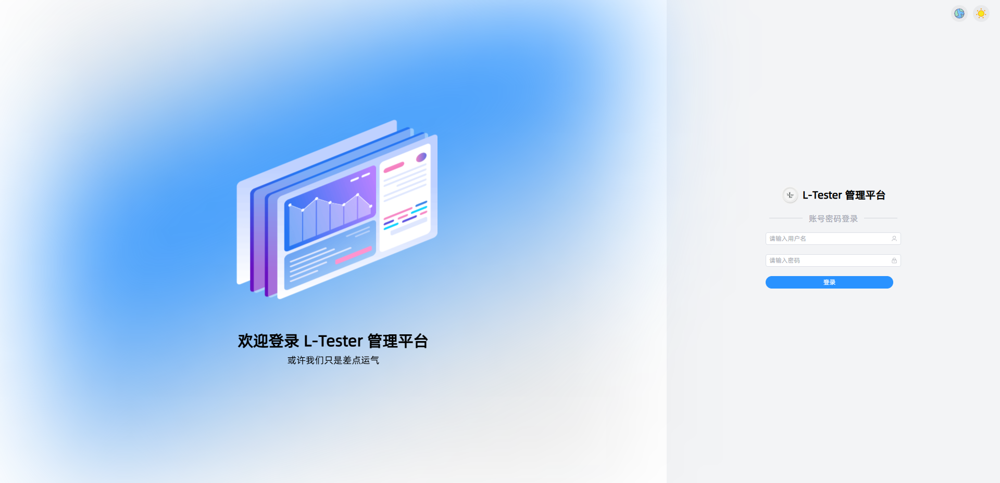
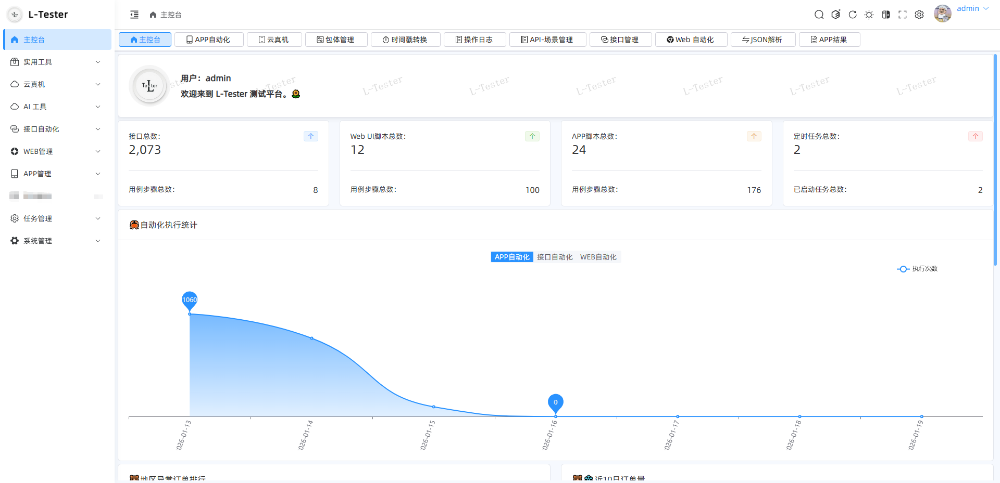
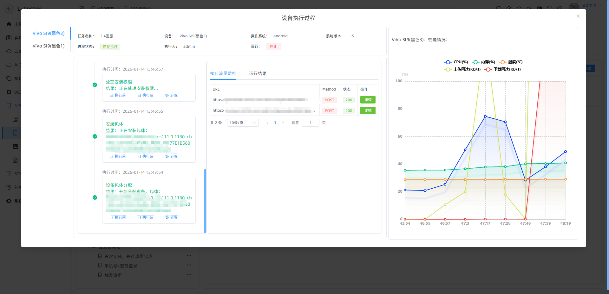
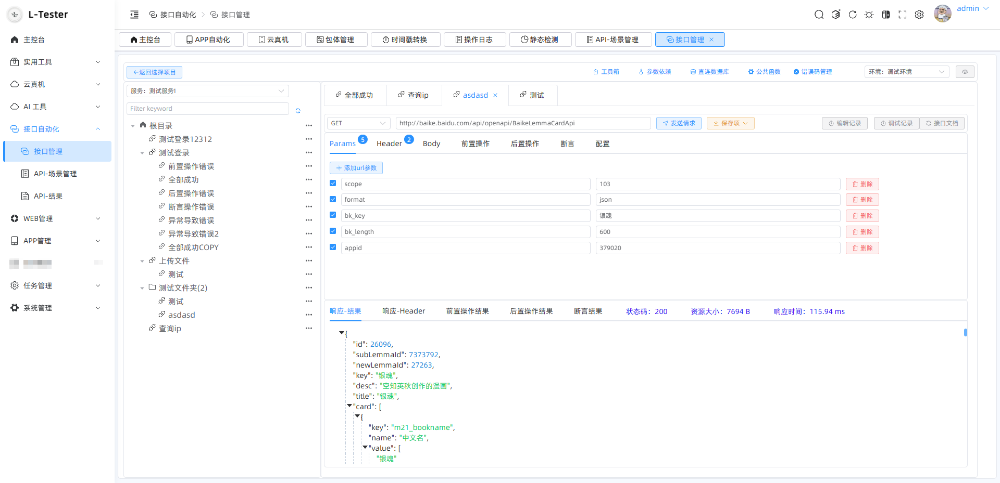
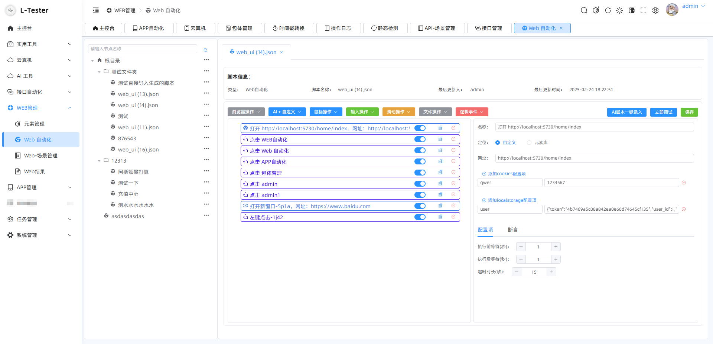
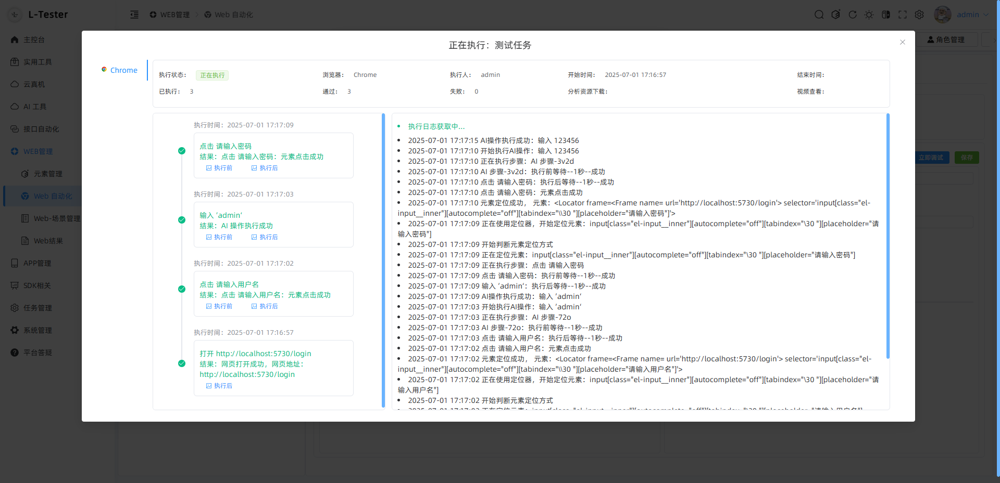
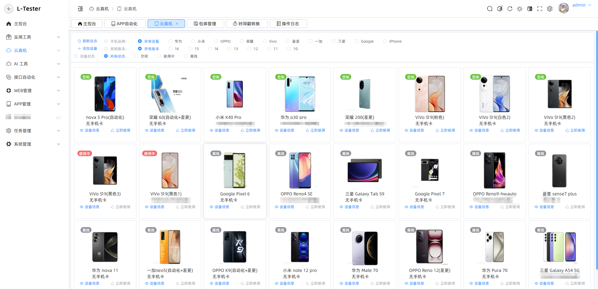
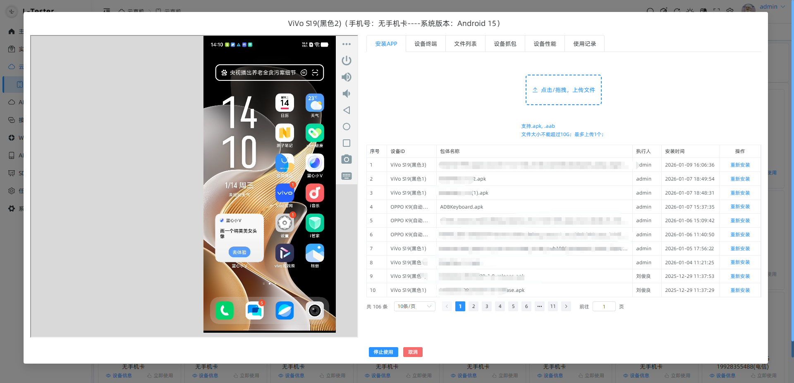

# L-Tester 全栈自动化测试平台（FastApi + Vue3）
## 在此郑重声明：本文内容未经本人同意，不得随意转载。若有违者，必将追究其法律责任。同时，禁止对相关源码进行任何形式的售卖行为，本内容仅供学习使用，不允许任何形式的商用
### 技术支持VX：L-Tester777

## 体验地址(功能更新不完整，尝尝鲜)：

- 地址：http://110.41.67.102:5730/
- 账号： tester 
- 密码：123456

## 技术栈：
- 1.Python Fastapi
- 2.Mysql-orm数据库操作
- 3.ADB操作
- 4.APP自动化-Airtest
- 5.Web自动化-Playwright
- 6.接口自动化-自研框架
- 7.定时任务-Apscheduler

## 主包编译版本：
- python v3.11.3
- node.js v22.20.0
- pnpm v10.18.2
- adb
- Mysql8
- JDK v17.0.12

# 部署指引
#### 控制台执行：
#### 遇到安装失败的包，先考虑从requirements.txt中删除掉！！！！！！！！！！！
##### ！ 全局搜索“待修改”，修改对应数据，然后去手动创建数据库
- pip install -r requirements.txt  // 安装第三方库
- 激活虚拟环境（自行搜索如何创建虚拟环境）
- 初始化db：aerich init -t db_settings.TORTOISE_ORM
- 模型映射：aerich init-db
- 迁移命令：aerich migrate
- 更新命令：aerich upgrade（检查数据库表是否生成）
- 检查服务是否可以正常启动：python main.py (执行main.py文件)
- 首次登录账号：admin 密码：123456
##### 部分功能未完善，敬请期待

## 自动化测试功能
- API 自动化测试
- APP 自动化测试
- WEB UI 自动化测试

## 附加功能
- 云真机（基于ws-scrcpy，可自行去下载启动）
- 定时任务
- 加解密、时间戳转换
- 告警通知
- 权限管理

## 问题处理：
#### 1. 启动时遇到async_fixture问题：
1. 文件替换到\.venv\Lib\site-packages\autowing\playwright
2. 文件替换到\.venv\Lib\site-packages\autowing\core\llm\client
##### 文件夹地址：solve_problems

# 实际效果

